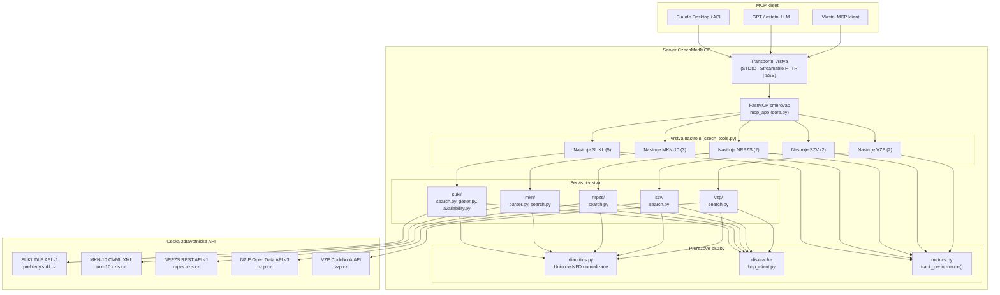
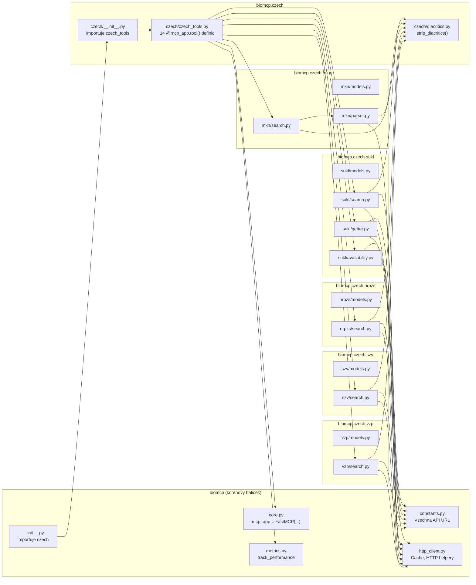
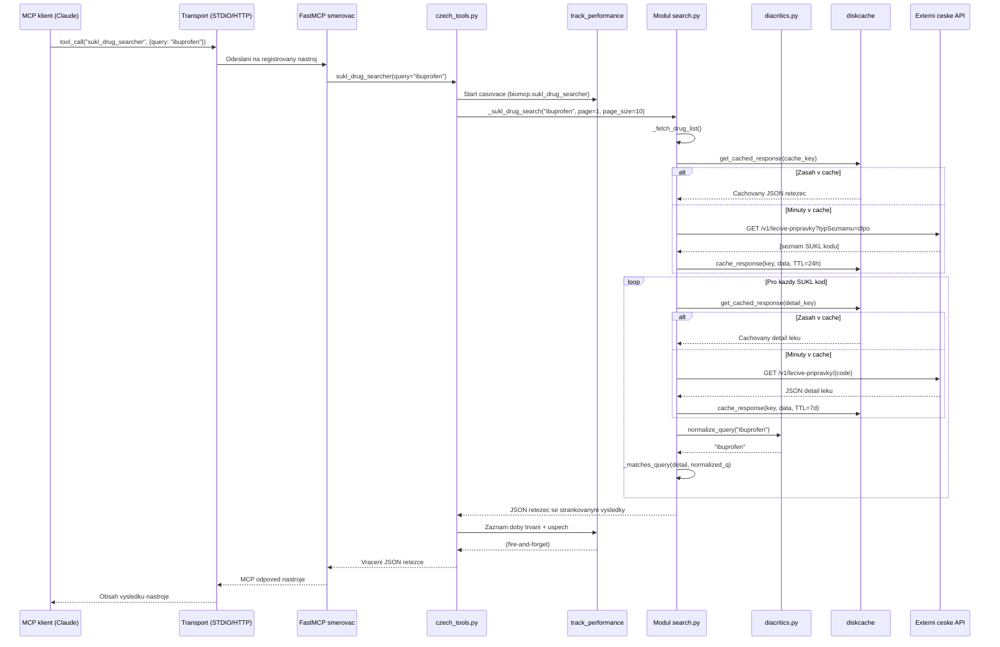

# Architektura CzechMedMCP -- technicka dokumentace

> **Komplexni technicka reference pro ceske zdravotnicke rozsireni MCP**
>
> Verze 1.0 | Unor 2026 | Vetev `001-czech-health-sources`

---

## Obsah

1. [Shrnuti](#1-shrnuti)
2. [Prehled systemu](#2-prehled-systemu)
3. [Diagramy architektury](#3-diagramy-architektury)
4. [Struktura modulu](#4-struktura-modulu)
5. [Datovy tok](#5-datovy-tok)
6. [Ceske datove zdroje](#6-ceske-datove-zdroje)
7. [Inventar nastroju](#7-inventar-nastroju-14-mcp-nastroju)
8. [Datove modely](#8-datove-modely-pydantic-v2)
9. [Strategie cachovani](#9-strategie-cachovani)
10. [Vzor registrace nastroju](#10-vzor-registrace-nastroju)
11. [Prurezove aspekty](#11-prurezove-aspekty)
12. [Architektura testovani](#12-architektura-testovani)
13. [Nasazeni a konfigurace](#13-nasazeni-a-konfigurace)
14. [Prilohy](#14-prilohy)

---

## 1. Shrnuti

**CzechMedMCP** je rozsireni projektu [BioMCP](https://github.com/genomoncology/biomcp) -- biomedicalniho serveru postaveneho na protokolu Model Context Protocol (MCP). Pridava **14 specializovanych nastroju** pro dotazovani ceskych zdravotnickych datovych zdroju. Rozsireni integruje pet autoritativnich ceskych registru -- SUKL (leky), MKN-10 (diagnozy), NRPZS (poskytovatele), SZV (vykony) a VZP (ciselniky) -- do jedineho MCP serveru, ktery muze vyuzit libovolny MCP-kompatibilni AI klient (Claude, GPT nebo vlastni agenti).

Ceske nastroje jsou organizovany do peti domenovych podbalicku v adresari `src/biomcp/czech/`, pricemz kazdy dodrzuje konzistentni trislozkovou architekturu: **modely** (Pydantic v2 schemata), **vyhledavani/getter** (servisni logika s cachovanim) a **registrace nastroju** (definice MCP koncovych bodu). Vsech 14 nastroju se automaticky registruje na serveru FastMCP pri importu a koexistuje s existujicimi globalni nastroji BioMCP (clanky, studie, varianty, geny, leky, nemoci atd.).

**Klicova navrhova rozhodnuti:**

- **Neinvazivni integrace** -- ceske nastroje jsou pridany jako samostatny podbalicek; zadny existujici kod BioMCP nebyl zmenen.
- **Transparentni vyhledavani bez ohledu na diakritiku** -- vsechny textove dotazy prochazi normalizaci Unicode NFD, coz umoznuje uzivateli hledat s diakritikou i bez ni (napr. "recnice" odpovida "recnice").
- **Agresivni cachovani s offline rezimu** -- kazda odpoved z externiho API je cachovana pomoci `diskcache` s TTL prizpusobenym domene (1 hodina az 30 dni). Offline rezim BioMCP (`BIOMCP_OFFLINE`) vraci cachovana data, kdyz sit neni dostupna.
- **Dvojjazycna data** -- modely uchovavaji puvodni ceske nazvy (`name_cs`) vedle anglickych prekladu, pokud jsou k dispozici.

---

## 2. Prehled systemu

### 2.1 Co je BioMCP?

BioMCP je open-source MCP server napsany v Pythonu, ktery poskytuje AI asistentum strukturovany pristup k biomedicalnim databazim. Obaluje API jako PubMed/PubTator3, ClinicalTrials.gov, MyVariant.info, cBioPortal a OpenFDA do MCP nastroju, ktere mohou LLM volat primo.

### 2.2 Co pridava CzechMedMCP?

CzechMedMCP rozsiruje BioMCP o domenove nastroje pro cesky zdravotnicky system. Zatimco BioMCP se zameruje na globalni biomedicinska vyzkumna data (anglicke publikace, americke klinicke studie, data FDA), CzechMedMCP cili na provozni vrstvu ceskeho zdravotnictvi:

| Oblast | BioMCP (globalni) | CzechMedMCP (cesky) |
|--------|-------------------|---------------------|
| Informace o lecich | OpenFDA -- stitky leku, stazeni z trhu | Registr lecivych pripravku SUKL |
| Diagnosticke kody | -- | MKN-10 / ICD-10 CZ (diagnozy) |
| Poskytovatele zdravotnich sluzeb | -- | Registr poskytovatelu NRPZS |
| Zdravotni vykony | -- | Seznam zdravotnich vykonu SZV |
| Ciselniky pojistovny | -- | Ciselnik VZP |
| Jazyk | Anglictina | Cestina + anglictina |

### 2.3 Technologicky zasobnik

| Vrstva | Technologie | Verze | Ucel |
|--------|-------------|-------|------|
| MCP framework | `mcp[cli]` / FastMCP | >= 1.12.3 | Registrace nastroju, transport (STDIO/HTTP) |
| HTTP klient | `httpx` | >= 0.28.1 | Asynchronni HTTP pozadavky na ceska API |
| Validace dat | `pydantic` | >= 2.10.6 | Modely pozadavku a odpovedi |
| Parsovani XML | `lxml` | >= 5.0.0 | ClaML XML pro MKN-10 |
| Cachovani | `diskcache` | >= 5.6.3 | Persistentni cache odpovedi |
| Adresare platformy | `platformdirs` | >= 4.3.6 | Nativni adresar pro cache dle OS |
| Behove prostredi | Python | >= 3.10, < 4.0 | Async/await, syntaxe `str \| None` |

---

## 3. Diagramy architektury

### 3.1 Architektura systemu -- vysokourovnovy pohled



### 3.2 Graf zavislosti modulu



---

## 4. Struktura modulu

### 4.1 Rozlozeni balicku

```text
src/biomcp/
    __init__.py              # Korenovy init -- importuje podbalicek `czech`
    core.py                  # Instance FastMCP aplikace (mcp_app)
    constants.py             # Vsechna API URL vcetne ceskych koncovych bodu
    http_client.py           # Helpery pro diskcache: get/set/generate_cache_key
    metrics.py               # Dekorator @track_performance
    ...                      # (existujici moduly BioMCP)

    czech/
        __init__.py          # Importuje czech_tools pro spusteni automaticke registrace
        czech_tools.py       # 14 definic funkci @mcp_app.tool()
        diacritics.py        # strip_diacritics(), normalize_query()

        sukl/                # Registr lecivych pripravku SUKL (Statni ustav pro kontrolu leciv)
            __init__.py
            models.py        # Drug, DrugSummary, DrugSearchResult, ActiveSubstance, AvailabilityStatus
            search.py        # _sukl_drug_search() -- vzor seznam + filtrace
            getter.py        # _sukl_drug_details(), _sukl_spc_getter(), _sukl_pil_getter()
            availability.py  # _sukl_availability_check() -- koncovy bod VPOIS

        mkn/                 # MKN-10 ceska ICD-10 (Mezinarodni klasifikace nemoci)
            __init__.py
            models.py        # Diagnosis, DiagnosisHierarchy, DiagnosisCategory, Modifier
            parser.py        # ClaML XML parser, sestavuje code_index + text_index
            search.py        # _mkn_search(), _mkn_get(), _mkn_browse()

        nrpzs/               # Registr poskytovatelu NRPZS (Narodni registr poskytovatelu)
            __init__.py
            models.py        # HealthcareProvider, ProviderSummary, Workplace, Address, Contact
            search.py        # _nrpzs_search(), _nrpzs_get()

        szv/                 # Seznam zdravotnich vykonu SZV
            __init__.py
            models.py        # HealthProcedure, ProcedureSearchResult
            search.py        # _szv_search(), _szv_get()

        vzp/                 # Ciselniky VZP (Vseobecna zdravotni pojistovna)
            __init__.py
            models.py        # CodebookEntry, CodebookSearchResult
            search.py        # _vzp_search(), _vzp_get()

tests/
    czech/
        __init__.py
        conftest.py          # Sdilene fixtury, vzorova data, SAMPLE_CLAML_XML
        test_diacritics.py
        test_mkn_models.py
        test_mkn_parser.py
        test_mkn_search.py
        test_nrpzs_getter.py
        test_nrpzs_search.py
        test_sukl_availability.py
        test_sukl_getter.py
        test_sukl_http_paths.py
        test_sukl_internals.py
        test_sukl_models.py
        test_sukl_search.py
        test_szv_getter.py
        test_szv_search.py
        test_tool_registration.py
        test_vzp_getter.py
        test_vzp_search.py
        test_no_regression.py
        test_performance.py
    czech_integration/
        test_sukl_api.py     # Integracni testy s zivym API
```

### 4.2 Zduvodneni navrhu -- proc tato struktura?

**Jeden podbalicek na datovou domenu.** Kazdy cesky zdravotnicky datovy zdroj ma zasadne odlisne datove modely, tvary API a pozadavky na cachovani. Udrzovani v samostatnych podbalickach zajistuje jasne hranice a umoznuje nezavisly vyvoj a testovani.

**Centralizovana registrace nastroju.** Vsech 14 MCP nastroju je definovano v jedinem souboru (`czech_tools.py`) namisto rozptyleni po podbalickach. To poskytuje jediny referencni bod pro porozumeni celemu povrchu ceskych nastroju, usnadnuje audit nazvu nastroju a schemat parametru a zajistuje konzistentni vzor vrstveni `@mcp_app.tool()` + `@track_performance()`.

**Oddeleni zodpovednosti.** Kazdy modul dodrzuje vzor tri souboru:

| Soubor | Zodpovednost |
|--------|-------------|
| `models.py` | Pydantic v2 datova schemata (cista data, zadne I/O operace) |
| `search.py` | Asynchronni servisni funkce s HTTP volanimi a cachovanim |
| `getter.py` / `parser.py` | Specializovana logika pro ziskavani nebo parsovani dat |

---

## 5. Datovy tok

### 5.1 Zivotni cyklus pozadavku

Nasledujici sekvencni diagram sleduje typicky pozadavek od MCP klienta pres externi API a zpet.



### 5.2 Klicove vzory toku dat podle modulu

| Modul | Vzor toku | Popis |
|-------|-----------|-------|
| **SUKL** (vyhledavani) | Seznam a filtrace | Nacte kompletni seznam SUKL kodu, pote nacita a filtruje jednotlive detaily leku |
| **SUKL** (getter) | Primy dotaz | Nacte detail leku, slozeni a metadata dokumentu podle SUKL kodu |
| **SUKL** (dostupnost) | Primy dotaz + VPOIS | Nacte detail leku pro potvrzeni existence, pote overi VPOIS distribuci |
| **MKN-10** | Jednou parsuj, mnohokrat dotazuj | Zparsuje ClaML XML do in-memory indexu (code_index + text_index), cachuje vysledek na 30 dni |
| **NRPZS** | Pruchozi vyhledavani | Predava parametry vyhledavani primo na REST API NRPZS se strankovanim |
| **SZV** | Seznam a filtrace | Nacte kompletni seznam vykonu z NZIP API, filtruje lokalne |
| **VZP** | Prohledavani vice ciselniku | Iteruje pres zname typy ciselniku, nacita kazdy seznam, filtruje lokalne |

### 5.3 Tok zpracovani chyb

Vsechny servisni funkce dodrzuji konzistentni vzor zpracovani chyb:

1. **Pokus o primarni API volani** uvnitr bloku `try/except httpx.HTTPError`.
2. **Pri HTTP 404** vraceni `None` (nenalezeno) misto vyvolani vyjimky.
3. **Pri chybe pripojeni/timeoutu** zaloguje varovani a vrati JSON objekt chyby s klicem `"error"`.
4. **Pri uspechu** cachuje odpoved a vrati serializovany JSON.

Volajici (funkce nastroje) nikdy nevyhazuje vyjimky smerem k MCP klientovi. Vsechny odpovedi jsou JSON retezce, vcetne chybovych odpovedi, coz zajistuje, ze LLM vzdy obdrzi strukturovana data, ktera muze interpretovat.

---

## 6. Ceske datove zdroje

### 6.1 Prehledova tabulka zdroju

| Zdroj | Plny nazev | Zakladni URL | Typ API | Datova domena | Vyzadovana autentizace |
|-------|-----------|--------------|---------|---------------|----------------------|
| **SUKL** | Statni ustav pro kontrolu leciv | `prehledy.sukl.cz/dlp/api` | REST JSON (DLP API v1) | Registr lecivych pripravku | Ne |
| **MKN-10** | Mezinarodni klasifikace nemoci, 10. revize | `mkn10.uzis.cz` | ClaML XML ke stazeni | Diagnosticke kody ICD-10 (diagnozy) | Ne |
| **NRPZS** | Narodni registr poskytovatelu zdravotnich sluzeb | `nrpzs.uzis.cz/api/v1` | REST JSON | Poskytovatele zdravotnich sluzeb | Ne |
| **SZV/NZIP** | Seznam zdravotnich vykonu / NZIP otevrena data | `nzip.cz/api/v3` | REST JSON | Zdravotni vykony | Ne |
| **VZP** | Vseobecna zdravotni pojistovna CR | `www.vzp.cz` | REST JSON | Ciselniky pojistovny | Ne |

### 6.2 SUKL -- Registr lecivych pripravku

**Instituce:** SUKL (Statni ustav pro kontrolu leciv)

**Koncove body API:**

| Koncovy bod | Metoda | Ucel |
|-------------|--------|------|
| `/v1/lecive-pripravky` | GET | Vypis vsech SUKL kodu leciv |
| `/v1/lecive-pripravky/{code}` | GET | Detail leku podle SUKL kodu |
| `/v1/slozeni/{code}` | GET | Slozeni leku (ucinne latky) |
| `/v1/dokumenty-metadata/{code}` | GET | Metadata dokumentu (SPC, PIL) |
| `/v1/dokumenty/{code}/{type}` | GET | URL ke stazeni dokumentu |
| `/v1/vpois/{code}` | GET | Informace o distributorovi (dostupnost) |

**Charakteristiky API:**

- DLP API v1 nepodporuje serverove textove vyhledavani; klient musi nacist kompletni seznam kodu a filtrovat lokalne.
- Detaily leku pouzivaji ceske nazvy poli v odpovedi API (napr. `nazev`, `kodSukl`, `kodAtc`, `nazevFormy`, `nazevDrzitele`).
- Typy dokumentu jsou `spc` (Souhrn udaju o pripravku) a `pil` (Pribalovy informacni letak).

**Definovano v:**
- `src/biomcp/czech/sukl/search.py` -- logika vyhledavani
- `src/biomcp/czech/sukl/getter.py` -- ziskani detailu, SPC, PIL
- `src/biomcp/czech/sukl/availability.py` -- overeni dostupnosti na trhu

### 6.3 MKN-10 -- Ceska klasifikace nemoci

**Instituce:** UZIS CR (Ustav zdravotnickych informaci a statistiky CR)

**Format dat:** ClaML (Classification Markup Language) XML

**Struktura dat:**

Klasifikace MKN-10 je organizovana jako strom:

```text
Kapitola (napr. "X" = Nemoci dychaci soustavy)
  +-- Blok (napr. "J00-J06" = Akutni infekce hornich cest dychacich)
        +-- Kategorie (napr. "J06" = Akutni infekce hornich cest dychacich ...)
              +-- Podkategorie (napr. "J06.9" = Akutni infekce hornich cest dychacich NS)
```

**Strategie parsovani:**

ClaML XML je zparsovano jednou modulem `mkn/parser.py` pomoci `lxml.etree`, ktery vytvori dva in-memory indexy:

1. **`code_index`** -- mapuje kazdy kod na jeho metadata: `{code, name_cs, kind, parent_code, children}`.
2. **`text_index`** -- invertovany index mapujici normalizovana slova na seznamy kodu pro fulltextove vyhledavani.

Oba indexy jsou serializovany do JSON a cachovany v `diskcache` (TTL: 30 dni) s klicem odvozenym z SHA-256 hashe obsahu XML. To znamena, ze indexy preziji restart serveru a jsou znovu parsovany pouze pri zmene obsahu XML.

**Definovano v:**
- `src/biomcp/czech/mkn/parser.py` -- parsovani ClaML XML a indexace
- `src/biomcp/czech/mkn/search.py` -- funkce vyhledavani, detailu a procházeni hierarchie

### 6.4 NRPZS -- Registr poskytovatelu zdravotnich sluzeb

**Instituce:** UZIS CR

**Koncove body API:**

| Koncovy bod | Metoda | Ucel |
|-------------|--------|------|
| `/api/v1/mista-poskytovani` | GET | Vyhledavani poskytovatelu (mist poskytovani) |
| `/api/v1/mista-poskytovani/{id}` | GET | Detail poskytovatele podle ID |

**Parametry dotazu:**

| Parametr | Cesky nazev | Popis |
|----------|------------|-------|
| `strana` | strana | Cislo stranky |
| `velikostStranky` | velikost stranky | Velikost stranky |
| `nazev` | nazev | Filtr podle nazvu poskytovatele |
| `obec` | obec | Filtr podle mesta/obce |
| `odbornost` | odbornost | Filtr podle lekarske odbornosti |

**Charakteristiky API:**

- API NRPZS podporuje serverove vyhledavani, takze parametry jsou predavany primo (na rozdil od klientske filtrace u SUKL).
- Zaznamy odpovedi pouzivaji ceske nazvy poli: `zaznamy` (zaznamy), `strankovani` (strankovani), `celkem` (celkem), `odbornosti` (odbornosti), `druhyPece` (druhy pece), `pracoviste` (pracoviste).

**Definovano v:**
- `src/biomcp/czech/nrpzs/search.py` -- vyhledavani a ziskani detailu

### 6.5 SZV/NZIP -- Seznam zdravotnich vykonu

**Instituce:**
- MZCR (Ministerstvo zdravotnictvi CR) -- vydava SZV
- NZIP (Narodni zdravotnicky informacni portal) -- poskytuje API

**Koncove body API:**

| Koncovy bod | Metoda | Ucel |
|-------------|--------|------|
| `/api/v3/vykony` | GET | Vypis vsech vykonu |
| `/api/v3/vykony/{code}` | GET | Detail vykonu podle kodu |

**Charakteristiky API:**

- NZIP API v3 vraci data vykonu s ceskymi nazvy poli: `kod` (kod), `nazev` (nazev), `body` (bodova hodnota), `skupina` (kategorie/skupina), `cas` (cas), `odbornosti` (odbornosti), `omezeni_frekvence` (omezeni frekvence).
- Doplnkovy koncovy bod SZV na `szv.mzcr.cz` je definovan, ale NZIP je primarni zdroj.
- Funkce `_szv_get` implementuje dvouurovnove vyhledavani: nejprve primy koncovy bod detailu, pote nahradni prohledani celeho seznamu.

**Definovano v:**
- `src/biomcp/czech/szv/search.py` -- vyhledavani a ziskani detailu

### 6.6 VZP -- Ciselniky pojistovny

**Instituce:** VZP CR (Vseobecna zdravotni pojistovna CR)

**Koncove body API:**

| Koncovy bod | Metoda | Ucel |
|-------------|--------|------|
| `/o-vzp/vzajemne-informace/ciselnik-vykonu/{type}` | GET | Vypis polozek pro typ ciselniku |
| `/o-vzp/vzajemne-informace/ciselnik-vykonu/{type}/{code}` | GET | Jednotliva polozka podle typu a kodu |

**Zname typy ciselniku:**

| Klic typu | Popis cesky | Popis anglicky |
|-----------|-------------|----------------|
| `seznam_vykonu` | Seznam vykonu | List of procedures |
| `diagnoza` | Diagnozy | Diagnoses |
| `lekarsky_predpis` | Lekarsky predpis | Prescriptions |
| `atc` | ATC klasifikace | ATC classification |

**Charakteristiky API:**

- Funkce `_vzp_search` prohledava vsechny zname typy ciselniku, pokud neni urcen konkretni typ, a iteruje pres data kazdeho typu, dokud nedosahne `max_results`.
- Ceske nazvy poli: `kod` (kod), `nazev` (nazev), `popis` (popis), `platnost_od` (platnost od), `platnost_do` (platnost do), `pravidla` (pravidla), `souvisejici_kody` (souvisejici kody).

**Definovano v:**
- `src/biomcp/czech/vzp/search.py` -- vyhledavani a ziskani detailu

---

## 7. Inventar nastroju (14 MCP nastroju)

Vsechny nastroje jsou definovany v `src/biomcp/czech/czech_tools.py` a organizovany do ctyr uzivatelsych pribehu (US1-US4).

### 7.1 US1: Registr leciv SUKL (5 nastroju)

| Nazev nastroje | Parametry | Popis | Klic metriky |
|----------------|-----------|-------|--------------|
| `sukl_drug_searcher` | `query: str`, `page: int=1`, `page_size: int=10` | Vyhledavani v ceskem registru leciv podle nazvu, latky nebo ATC kodu | `biomcp.sukl_drug_searcher` |
| `sukl_drug_getter` | `sukl_code: str` | Ziskani kompletniho detailu leku ze SUKL podle 7mistneho kodu | `biomcp.sukl_drug_getter` |
| `sukl_spc_getter` | `sukl_code: str` | Ziskani Souhrnu udaju o pripravku (SmPC / SPC) | `biomcp.sukl_spc_getter` |
| `sukl_pil_getter` | `sukl_code: str` | Ziskani Pribaloveho informacniho letaku (PIL) | `biomcp.sukl_pil_getter` |
| `sukl_availability_checker` | `sukl_code: str` | Overeni aktualni dostupnosti leku na trhu / stavu distribuce | `biomcp.sukl_availability_checker` |

### 7.2 US2: Diagnozy MKN-10 (3 nastroje)

| Nazev nastroje | Parametry | Popis | Klic metriky |
|----------------|-----------|-------|--------------|
| `mkn_diagnosis_searcher` | `query: str`, `max_results: int=10` | Vyhledavani podle kodu MKN-10 nebo volnym textem v cestine | `biomcp.mkn_diagnosis_searcher` |
| `mkn_diagnosis_getter` | `code: str` | Ziskani kompletniho detailu diagnozy vcetne hierarchie | `biomcp.mkn_diagnosis_getter` |
| `mkn_category_browser` | `code: str\|None=None` | Procházeni hierarchie kategorii MKN-10 (bez kodu pro korenove kapitoly) | `biomcp.mkn_category_browser` |

### 7.3 US3: Poskytovatele NRPZS (2 nastroje)

| Nazev nastroje | Parametry | Popis | Klic metriky |
|----------------|-----------|-------|--------------|
| `nrpzs_provider_searcher` | `query: str\|None`, `city: str\|None`, `specialty: str\|None`, `page: int=1`, `page_size: int=10` | Vyhledavani poskytovatelu podle nazvu, mesta nebo odbornosti | `biomcp.nrpzs_provider_searcher` |
| `nrpzs_provider_getter` | `provider_id: str` | Ziskani kompletniho detailu poskytovatele vcetne pracovist | `biomcp.nrpzs_provider_getter` |

### 7.4 US4: SZV + VZP (4 nastroje)

| Nazev nastroje | Parametry | Popis | Klic metriky |
|----------------|-----------|-------|--------------|
| `szv_procedure_searcher` | `query: str`, `max_results: int=10` | Vyhledavani zdravotnich vykonu podle kodu nebo nazvu | `biomcp.szv_procedure_searcher` |
| `szv_procedure_getter` | `code: str` | Ziskani kompletniho detailu vykonu s bodovou hodnotou | `biomcp.szv_procedure_getter` |
| `vzp_codebook_searcher` | `query: str`, `codebook_type: str\|None`, `max_results: int=10` | Vyhledavani v ciselnicich VZP -- ve vsech nebo v jednom typu | `biomcp.vzp_codebook_searcher` |
| `vzp_codebook_getter` | `codebook_type: str`, `code: str` | Ziskani detailu polozky ciselniku podle typu a kodu | `biomcp.vzp_codebook_getter` |

---

## 8. Datove modely (Pydantic v2)

Vsechny modely pouzivaji `BaseModel` z Pydantic v2 s anotacemi `Field(description=...)`. To zajistuje jak validaci za behu, tak generovani bohatych JSON schemat pro introspekci MCP nastroju.

### 8.1 Modely SUKL (`src/biomcp/czech/sukl/models.py`)

```python
class ActiveSubstance(BaseModel):
    name: str                          # Nazev ucinne latky (napr. "Ibuprofen")
    strength: str | None               # Sila (napr. "400 mg")

class AvailabilityStatus(BaseModel):
    status: str                        # "available", "limited" nebo "unavailable"
    last_checked: str | None           # Datum a cas ve formatu ISO 8601
    note: str | None                   # Doplnujici poznamka

class Drug(BaseModel):
    sukl_code: str                     # 7mistny identifikator SUKL
    name: str                          # Obchodni nazev
    active_substances: list[ActiveSubstance]
    pharmaceutical_form: str | None    # Leková forma (napr. "potahovane tablety")
    atc_code: str | None               # Kod ATC klasifikace
    registration_number: str | None    # Cislo registrace
    mah: str | None                    # Drzitel rozhodnuti o registraci
    registration_valid_to: str | None  # Datum platnosti registrace
    availability: AvailabilityStatus | None
    spc_url: str | None                # URL na dokument SmPC
    pil_url: str | None                # URL na dokument PIL
    source: str = "SUKL"

class DrugSummary(BaseModel):          # Odlehcena verze pro vysledky vyhledavani
    sukl_code: str
    name: str
    active_substance: str | None
    atc_code: str | None
    pharmaceutical_form: str | None

class DrugSearchResult(BaseModel):     # Obalka strankovanych vysledku
    total: int
    page: int
    page_size: int
    results: list[DrugSummary]
```

### 8.2 Modely MKN-10 (`src/biomcp/czech/mkn/models.py`)

```python
class DiagnosisHierarchy(BaseModel):
    chapter: str                       # Kod kapitoly (napr. "X")
    chapter_name: str                  # Cesky nazev (napr. "Nemoci dychaci soustavy")
    block: str                         # Kod bloku (napr. "J00-J06")
    block_name: str                    # Cesky nazev bloku
    category: str                      # Kod kategorie (napr. "J06")

class Modifier(BaseModel):
    code: str
    name: str                          # Cesky nazev modifikatoru

class Diagnosis(BaseModel):
    code: str                          # Kod diagnozy (napr. "J06.9")
    name_cs: str                       # Cesky nazev
    name_en: str | None                # Anglicky nazev (pokud je k dispozici)
    definition: str | None
    hierarchy: DiagnosisHierarchy | None
    includes: list[str]                # Zahrnute stavy
    excludes: list[str]                # Vyloucene stavy
    modifiers: list[Modifier]
    source: str = "UZIS/MKN-10"

class DiagnosisCategory(BaseModel):    # Uzel pro navigaci v hierarchii
    code: str
    name: str                          # Cesky nazev
    type: str                          # "chapter", "block" nebo "category"
    children: list["DiagnosisCategory"]
    parent_code: str | None
```

### 8.3 Modely NRPZS (`src/biomcp/czech/nrpzs/models.py`)

```python
class Address(BaseModel):
    street: str | None                 # ulice
    city: str | None                   # obec
    postal_code: str | None            # PSC
    region: str | None                 # kraj

class Contact(BaseModel):
    phone: str | None                  # telefon
    email: str | None
    website: str | None                # www

class Workplace(BaseModel):            # Misto poskytovani
    workplace_id: str
    name: str
    address: Address | None
    specialties: list[str]             # odbornosti
    contact: Contact | None

class HealthcareProvider(BaseModel):
    provider_id: str                   # Identifikator NRPZS
    name: str                          # Nazev poskytovatele nebo zarizeni
    legal_form: str | None             # pravni forma (napr. "fyzicka osoba")
    ico: str | None                    # ICO (identifikacni cislo organizace)
    address: Address | None
    specialties: list[str]             # odbornosti
    care_types: list[str]              # druhy pece (napr. "ambulantni", "luzkova")
    workplaces: list[Workplace]
    registration_number: str | None
    source: str = "NRPZS"

class ProviderSummary(BaseModel):      # Odlehcena verze pro vyhledavani
    provider_id: str
    name: str
    city: str | None
    specialties: list[str]

class ProviderSearchResult(BaseModel):
    total: int
    page: int
    page_size: int = 10
    results: list[ProviderSummary]
```

### 8.4 Modely SZV (`src/biomcp/czech/szv/models.py`)

```python
class HealthProcedure(BaseModel):
    code: str                          # Kod vykonu (napr. "09513")
    name: str                          # Nazev vykonu
    category: str | None               # Kod kategorie (napr. "09")
    category_name: str | None          # Popisny nazev kategorie
    point_value: int | None            # Bodova hodnota (pro uhradovy mechanismus)
    time_minutes: int | None           # Odhadovany cas vykonu v minutach
    frequency_limit: str | None        # Omezeni frekvence (napr. "1x rocne")
    specialty_codes: list[str]         # Ktere odbornosti mohou vykon provadet
    material_requirements: str | None  # Pozadovane materialy
    notes: str | None                  # Doplnujici poznamky
    source: str = "MZCR/SZV"

class ProcedureSearchResult(BaseModel):
    total: int
    results: list[dict]                # Souhrnne slovniky vykonu
```

### 8.5 Modely VZP (`src/biomcp/czech/vzp/models.py`)

```python
class CodebookEntry(BaseModel):
    codebook_type: str                 # Identifikator typu (napr. "seznam_vykonu")
    code: str                          # Kod polozky
    name: str                          # Nazev polozky
    description: str | None            # Podrobny popis
    valid_from: str | None             # platnost_od (ISO 8601)
    valid_to: str | None               # platnost_do (ISO 8601)
    rules: list[str]                   # Pravidla vyuctovani/uhrady
    related_codes: list[str]           # Souvisejici kody ciselniku
    source: str = "VZP"

class CodebookSearchResult(BaseModel):
    total: int
    results: list[dict]                # Souhrnne slovniky polozek ciselniku
```

### 8.6 Principy navrhu modelu

1. **Vsechna pole maji popisy.** Anotace `Field(description=...)` slouzi dvema ucelum: dokumentuji pole pro vyvojare a generuji popisy JSON schemat, ktere MCP klienti mohou vyuzit pro introspekci nastroju.

2. **Volitelna pole pouzivaji syntaxi `str | None`.** To vyuziva union syntaxi Pythonu 3.10+ namisto `Optional[str]`, v souladu se stylovymi pravidly projektu.

3. **Pole `source` na kazde entite.** Kazdy hlavni model obsahuje pole `source: str` s vychozi hodnotou (napr. `"SUKL"`, `"UZIS/MKN-10"`, `"NRPZS"`, `"MZCR/SZV"`, `"VZP"`). To umoznuje spotrebitelum sledovat puvod dat, kdyz se kombinuji vysledky z vice zdroju.

4. **Souhrnne vs. uplne modely.** Vysledky vyhledavani vraceji odlehcene souhrnne modely (napr. `DrugSummary`, `ProviderSummary`) pro udrzeni nizke spotrebovanych tokenu, zatimco getter nastroje vraceji uplne modely (napr. `Drug`, `HealthcareProvider`).

---

## 9. Strategie cachovani

### 9.1 Infrastruktura cache

CzechMedMCP pouziva stejnou infrastrukturu `diskcache` jako zbytek BioMCP:

```python
# src/biomcp/http_client.py
from diskcache import Cache
from platformdirs import user_cache_dir

def get_cache() -> Cache:
    cache_path = os.path.join(user_cache_dir("biomcp"), "http_cache")
    return Cache(cache_path)
```

Cache je ulozena na miste odpovidajicim operacnimu systemu:
- **macOS:** `~/Library/Caches/biomcp/http_cache`
- **Linux:** `~/.cache/biomcp/http_cache`
- **Windows:** `~\AppData\Local\biomcp\Cache\http_cache`

### 9.2 Generovani klicu cache

Klice cache jsou generovany pomoci `generate_cache_key(method, url, params)`:

- Pro pozadavky bez parametru: `"{METHOD}:{URL}"`
- Pro pozadavky s parametry: 16znakovy hexadecimalni hash z `"{METHOD}:{URL}:{serazeny_params_json}"`

### 9.3 Konfigurace TTL podle modulu

| Modul | Operace | TTL | Zduvodneni |
|-------|---------|-----|-----------|
| **SUKL** | Seznam leku (`lecive-pripravky`) | 24 hodin | Seznam se meni zridka; denni obnova staci |
| **SUKL** | Detail leku | 7 dni | Jednotlive zaznamy leku jsou stabilni |
| **SUKL** | Slozeni, metadata dokumentu | 7 dni | Stabilni pro dany lek |
| **SUKL** | Dostupnost (VPOIS) | 1 hodina | Dostupnost se muze menit casto |
| **MKN-10** | Zparsovane ClaML indexy | 30 dni | Revize klasifikace jsou rocni; 30denni TTL vyvazuje aktuálnost a naklady na parsovani |
| **NRPZS** | Vysledky vyhledavani poskytovatelu | 24 hodin | Poskytovatele obcas meni adresy/odbornosti |
| **NRPZS** | Detail poskytovatele | 7 dni | Stabilni po nacteni |
| **SZV** | Seznam vykonu | 24 hodin | Seznamy vykonu se aktualizuji maximalne ctvrtletne |
| **SZV** | Detail vykonu | 7 dni | Stabilni pro dany vykon |
| **VZP** | Seznam ciselniku | 24 hodin | Ciselniky se aktualizuji periodicky |
| **VZP** | Detail polozky ciselniku | 7 dni | Jednotlive polozky jsou stabilni |

### 9.4 Offline rezim

Kdyz je nastavena promenna prostredi `BIOMCP_OFFLINE=true`, modul `http_client.py` v BioMCP zachyti vsechna API volani a vraci pouze cachovane odpovedi. Pokud cachovana data neexistuji, je vracena chyba `503`. Toto je reseno na urovni infrastruktury ve funkci `_handle_offline_mode()` a plati pro vsechny ceske moduly transparentne.

> **Poznamka:** Ceske moduly pouzivaji `httpx.AsyncClient` primo misto wrapperu `request_api()` z `http_client.py`. Implementuji vlastni vzor "cache first" volanim `get_cached_response()` pred HTTP pozadavky. To znamena, ze offline podpora pro ceske moduly funguje pres vrstvu cache, ale kontrola promenne prostredi `BIOMCP_OFFLINE` neni v ceskem servisnim kodu explicitne provadena. Cachovane odpovedi jsou vzdy konzultovany jako prvni, coz poskytuje de facto offline podporu.

### 9.5 Vzor interakce s cache

Kazda servisni funkce dodrzuje tento vzor:

```python
async def _fetch_something(identifier: str) -> dict | None:
    url = f"{BASE_URL}/endpoint/{identifier}"
    cache_key = generate_cache_key("GET", url, {})

    # 1. Nejprve zkontrolovat cache
    cached = get_cached_response(cache_key)
    if cached:
        return json.loads(cached)

    # 2. Provest HTTP pozadavek
    try:
        async with httpx.AsyncClient(timeout=30.0) as client:
            resp = await client.get(url)
            if resp.status_code == 404:
                return None
            resp.raise_for_status()
            data = resp.json()
    except httpx.HTTPError:
        logger.warning("Failed to fetch: %s", identifier)
        return None

    # 3. Ulozit do cache a vratit
    cache_response(cache_key, json.dumps(data), TTL)
    return data
```

---

## 10. Vzor registrace nastroju

### 10.1 Retezec automaticke registrace

Registrace nastroju je spustena importnim systemem Pythonu:

```text
biomcp/__init__.py
    --> import czech                    # Radek: from . import czech
        --> czech/__init__.py
            --> import czech_tools      # Radek: from . import czech_tools
                --> czech_tools.py se spusti
                    --> dekoratory @mcp_app.tool() zaregistruji 14 nastroju
```

To znamena, ze jakmile je balicek `biomcp` naimportovan (coz nastava pri startu serveru), vsechny ceske nastroje jsou automaticky zaregistrovany u instance FastMCP.

### 10.2 Vzor definice nastroje

Kazdy cesky nastroj dodrzuje presne tento vzor vrstveni:

```python
@mcp_app.tool()                              # Registrace ve FastMCP
@track_performance("biomcp.{domain}")   # Sledovani vykonu
async def tool_name(
    param: Annotated[
        type,
        Field(description="..."),            # Popis pro MCP schema
    ],
    optional_param: Annotated[
        type,
        Field(description="...", ge=1, le=100),
    ] = default_value,
) -> str:
    """Docstring se stane popisem MCP nastroje."""
    return await _private_service_function(param, optional_param)
```

Klicove aspekty tohoto vzoru:

1. **`@mcp_app.tool()`** -- dekorator FastMCP, ktery registruje funkci jako MCP nastroj. Nazev funkce se stane nazvem nastroje (napr. `sukl_drug_searcher`).

2. **`@track_performance()`** -- zaznamenava dobu provedeni a metriky uspechu/neuspechu. Nazev metriky dodrzuje vzor `biomcp.{modul}_{operace}`.

3. **`Annotated[type, Field(...)]`** -- deskriptory Pydantic `Field` uvnitr `typing.Annotated` poskytuji jak validacni omezeni (`ge`, `le`), tak popisy zobrazene ve schematu MCP nastroje.

4. **Navratovy typ je vzdy `str`** -- vsechny nastroje vraceji JSON serializovany retezec. Toto je navrhove rozhodnuti, ktere udrzuje odpoved MCP jednoduchou a vyhnuje se slozitemu marshalovani typu.

5. **Delegace na privatni funkce** -- telo funkce nastroje je jediny radek delegujici na funkci s prefixem `_` v servisnim modulu. To oddeluje MCP aspekty (validace parametru, generovani schemat) od obchodni logiky (HTTP volani, cachovani, transformace dat).

### 10.3 Overeni

Registrace nastroju je overena testy v `tests/czech/test_tool_registration.py`:

```python
EXPECTED_CZECH_TOOLS = [
    "sukl_drug_searcher",
    "sukl_drug_getter",
    "sukl_spc_getter",
    "sukl_pil_getter",
    "sukl_availability_checker",
    "mkn_diagnosis_searcher",
    "mkn_diagnosis_getter",
    "mkn_category_browser",
    "nrpzs_provider_searcher",
    "nrpzs_provider_getter",
    "szv_procedure_searcher",
    "szv_procedure_getter",
    "vzp_codebook_searcher",
    "vzp_codebook_getter",
]
```

Test potvrzuje:
- Vsech 14 nastroju je zaregistrovano podle nazvu.
- Presne 14 nastroju ma cesky prefixovane nazvy.
- Globalni nastroje BioMCP stale koexistuji (celkovy pocet nastroju > 14).

---

## 11. Prurezove aspekty

### 11.1 Normalizace diakritiky (transparentni vyhledavani cesky/ASCII)

**Soubor:** `src/biomcp/czech/diacritics.py`

Cesky jazyk hojne pouziva diakriticka znamenka (napr. c, r, z, s, e, u). Uzivatele interagujici s AI asistentem mohou zadavat dotazy s diakritikou i bez ni. Modul `diacritics.py` zajistuje transparentni porovnavani:

```python
import unicodedata

def strip_diacritics(text: str) -> str:
    """napr. 'recnice' -> 'recnice', 'Nurofen' -> 'nurofen'"""
    nfkd = unicodedata.normalize("NFD", text)
    return "".join(c for c in nfkd if unicodedata.category(c) != "Mn").lower()

def normalize_query(query: str) -> str:
    return strip_diacritics(query.strip())
```

**Jak to funguje:**

1. **NFD dekompozice** -- `unicodedata.normalize("NFD", ...)` rozklada slozene znaky na zakladni znak + kombinujici znamenko (napr. "c" -> "c" + kombinujici hacek).
2. **Odstraneni kombinujicich znamenek** -- znaky s Unicode kategorii `Mn` (Mark, Nonspacing) jsou odstraneny.
3. **Prevod na mala pismena** -- vysledek je preveden na mala pismena pro porovnavani bez ohledu na velikost.

**Vzor pouziti:** Jak vyhledavaci dotaz, tak indexovany/API text jsou normalizovany pred porovnanim:

```python
normalized_q = normalize_query(user_query)       # "ibuprofen" nebo "recnice"
name = normalize_query(detail.get("nazev", ""))   # "recnice" -> "recnice"
if normalized_q in name:                          # Odpovida bez ohledu na diakritiku
    ...
```

**Kde se pouziva:**

| Modul | Normalizovana pole |
|-------|-------------------|
| SUKL `search.py` | Nazev leku (`nazev`), doplnek nazvu (`doplnekNazvu`), nazev drzitele (`nazevDrzitele`) |
| MKN-10 `parser.py` | Vsechny ceske stitky pri stavbe textoveho indexu |
| MKN-10 `search.py` | Slova uzivatelskeho dotazu pro fulltextove vyhledavani |
| NRPZS `search.py` | Nazev poskytovatele (`nazev`), obec (`obec`), odbornost (`odbornost`) v parametrech dotazu |
| SZV `search.py` | Nazev vykonu (`nazev`), kategorie (`skupina`) |
| VZP `search.py` | Nazev polozky (`nazev`), popis (`popis`), typ ciselniku |

### 11.2 Sledovani vykonu

**Soubor:** `src/biomcp/metrics.py`

Kazdy cesky MCP nastroj je dekorovan `@track_performance("biomcp.{name}")`, coz:

1. Zaznamena **pocatecni cas** pomoci `time.perf_counter()`.
2. Pocka na dokonceni asynchronni funkce nastroje.
3. Zaznamena **dobu trvani**, **uspech/neuspech** a pripadnou **chybovou zpravu**.
4. Asynchronne zavola `record_metric()` (fire-and-forget).

Metriky jsou aktivni pouze pokud je nastavena promenna prostredi `BIOMCP_METRICS_ENABLED=true`. Kdyz jsou vypnute, dekorator stale obaluje funkci, ale zaznam metrik je no-op.

Nazvy metrik dodrzuji konzistentni jmenny prostor:

```text
biomcp.sukl_drug_searcher
biomcp.sukl_drug_getter
biomcp.sukl_spc_getter
biomcp.sukl_pil_getter
biomcp.sukl_availability_checker
biomcp.mkn_diagnosis_searcher
biomcp.mkn_diagnosis_getter
biomcp.mkn_category_browser
biomcp.nrpzs_provider_searcher
biomcp.nrpzs_provider_getter
biomcp.szv_procedure_searcher
biomcp.szv_procedure_getter
biomcp.vzp_codebook_searcher
biomcp.vzp_codebook_getter
```

### 11.3 Zpracovani chyb

Vsechny ceske servisni funkce dodrzuji defenzivni strategii zpracovani chyb:

1. **Zadne vyjimky se nesiri k MCP klientovi.** Kazdy nastroj vraci platny JSON retezec, a to i pri chybe.

2. **Format chyboveho JSON:**
   ```json
   {"error": "Popisna chybova zprava"}
   ```

3. **Funkce vyhledavani zahrnuji prazdne vysledky pri chybe:**
   ```json
   {
     "total": 0,
     "page": 1,
     "page_size": 10,
     "results": [],
     "error": "SUKL API unavailable: Connection refused"
   }
   ```

4. **HTTP 404 je povazovano za "nenalezeno", ne za chybu.** Funkce vraceji `None` pri 404 a volajici to prevede na odpovidajici chybovy JSON.

5. **Logovani.** Vsechny HTTP chyby jsou logovany na urovni `WARNING` pres logger specificke pro modul. Chyby parsovani (napr. MKN-10 XML) jsou logovany na urovni `ERROR`.

### 11.4 Vzor HTTP klienta

Ceske moduly pouzivaji `httpx.AsyncClient` primo namisto wrapperu `request_api()` z BioMCP. Toto navrhove rozhodnuti bylo ucineno, protoze:

- Ceska API vraceji surovy JSON vyzadujici transformaci specificou pro kazdy modul, ne prime parsovani do Pydantic modelu.
- Ceske moduly potrebuji jemnozrnnou kontrolu nad TTL cache pro kazdy koncovy bod.
- API nevyzaduji autentizaci, prizpusobeni SSL ani omezeni poctu pozadavku.

Kazdy modul vytvari kratkodobe instance `httpx.AsyncClient` s 30sekundovym timeoutem:

```python
async with httpx.AsyncClient(timeout=30.0) as client:
    resp = await client.get(url, params=params)
```

### 11.5 Mapovani ceskych a anglickych poli

Opakujicim se vzorem napric vsemi moduly je mapovani z ceskych nazvu poli API na anglicke nazvy poli modelu. To se provadi v privatnich mapovacich funkcich:

| Ceske pole API | Anglicke pole modelu | Modul |
|----------------|---------------------|-------|
| `nazev` | `name` | Vsechny moduly |
| `kodSukl` | `sukl_code` | SUKL |
| `kodAtc` | `atc_code` | SUKL |
| `nazevFormy` | `pharmaceutical_form` | SUKL |
| `nazevDrzitele` | `mah` (drzitel registrace) | SUKL |
| `registracniCislo` | `registration_number` | SUKL |
| `platnostRegistrace` | `registration_valid_to` | SUKL |
| `nazevLatky` | substance `name` | SUKL (slozeni) |
| `mnozstvi` / `jednotka` | `strength` | SUKL (slozeni) |
| `zaznamy` | records (pole vysledku vyhledavani) | NRPZS |
| `strankovani` | pagination object | NRPZS |
| `celkem` | `total` | NRPZS |
| `odbornosti` | `specialties` | NRPZS |
| `druhyPece` | `care_types` | NRPZS |
| `pracoviste` | `workplaces` | NRPZS |
| `pravniForma` | `legal_form` | NRPZS |
| `ico` | `ico` (identifikacni cislo organizace) | NRPZS |
| `obec` | `city` | NRPZS |
| `psc` | `postal_code` | NRPZS |
| `kraj` | `region` | NRPZS |
| `kod` | `code` | SZV, VZP |
| `body` | `point_value` | SZV |
| `skupina` | `category` | SZV |
| `cas` | `time_minutes` | SZV |
| `omezeni_frekvence` | `frequency_limit` | SZV |
| `materialni_pozadavky` | `material_requirements` | SZV |
| `poznamky` | `notes` | SZV |
| `popis` | `description` | VZP |
| `platnost_od` / `platnost_do` | `valid_from` / `valid_to` | VZP |
| `pravidla` | `rules` | VZP |
| `souvisejici_kody` | `related_codes` | VZP |

---

## 12. Architektura testovani

### 12.1 Organizace testu

Testy se nachazi v `tests/czech/` (jednotkove testy) a `tests/czech_integration/` (integracni testy s zivym API).

**Jednotkove testy (21 souboru):**

| Testovaci soubor | Pokryta oblast |
|-----------------|---------------|
| `test_diacritics.py` | Unicode normalizace, strip_diacritics, normalize_query |
| `test_sukl_models.py` | Validace Pydantic modelu pro SUKL typy |
| `test_sukl_search.py` | Logika vyhledavani leku s mockovanym HTTP |
| `test_sukl_getter.py` | Ziskavani detailu leku, SPC, PIL s mockovanym HTTP |
| `test_sukl_availability.py` | Overeni dostupnosti s mockovanym VPOIS |
| `test_sukl_http_paths.py` | Spravna konstrukce URL pro API koncove body |
| `test_sukl_internals.py` | Interni pomocne funkce (_matches_query, _detail_to_summary) |
| `test_mkn_models.py` | Validace Pydantic modelu pro MKN-10 typy |
| `test_mkn_parser.py` | Parsovani ClaML XML, stavba indexu |
| `test_mkn_search.py` | Vyhledavani podle kodu, textove vyhledavani, rozliseni hierarchie |
| `test_nrpzs_search.py` | Vyhledavani poskytovatelu s mockovanym HTTP |
| `test_nrpzs_getter.py` | Ziskavani detailu poskytovatele s mockovanym HTTP |
| `test_szv_search.py` | Vyhledavani vykonu s mockovanym NZIP API |
| `test_szv_getter.py` | Detail vykonu s logiku nahradniho vyhledavani |
| `test_vzp_search.py` | Vyhledavani v ciselnicich napric vice typy |
| `test_vzp_getter.py` | Ziskani polozky ciselniku s nahradnim vyhledavanim |
| `test_tool_registration.py` | Vsech 14 nastroju zaregistrovano, koexistence s globalnimi nastroji |
| `test_no_regression.py` | Existujici funkcionalita BioMCP neovlivnena |
| `test_performance.py` | Zaznam vykonnostnich metrik |

**Integracni testy (1 soubor):**

| Testovaci soubor | Pokryta oblast |
|-----------------|---------------|
| `test_sukl_api.py` | Ziva volani SUKL API (oznaceno `@pytest.mark.integration`) |

### 12.2 Testovaci fixtury

Sdilene fixtury jsou definovany v `tests/czech/conftest.py`:

- **`mock_httpx_response`** -- tovarni fixtura vytvarejici mock objekty `httpx.Response` s konfigurovatelnym stavovym kodem a JSON daty.
- **`sample_sukl_drug`** -- vzorovy slovnik zaznamu leku SUKL.
- **`sample_sukl_search_response`** -- vzorova strankovana odpoved vyhledavani.
- **`sample_nrpzs_provider`** -- vzorovy slovnik zaznamu poskytovatele NRPZS.
- **`SAMPLE_CLAML_XML`** -- kompletni mini ClaML XML dokument s hierarchii kapitola/blok/kategorie pro testovani parsovani MKN-10.

### 12.3 Spousteni testu

```bash
# Spusteni vsech ceskych jednotkovych testu
pytest tests/czech/ -v

# Spusteni integracnich testu (vyzaduje sit)
pytest tests/czech_integration/ -v -m integration

# Spusteni s merenim pokryti
pytest tests/czech/ --cov=src/biomcp/czech --cov-report=term-missing
```

---

## 13. Nasazeni a konfigurace

### 13.1 Rezimy spusteni serveru

CzechMedMCP podporuje tri transportni rezimy:

| Rezim | Prikaz | Pripad pouziti |
|-------|--------|---------------|
| STDIO | `biomcp server run --mode stdio` | Lokalni AI klient (Claude Desktop) |
| Streamable HTTP | `biomcp server run --mode streamable_http --port 8000` | Vzdaleni klienti, produkce |
| Worker (SSE) | `biomcp server run --mode worker --port 8000` | Zastaraly SSE transport |

### 13.2 Promenne prostredi

| Promenna | Vychozi hodnota | Popis |
|----------|----------------|-------|
| `BIOMCP_OFFLINE` | `false` | Aktivace offline rezimu (odpovedi pouze z cache) |
| `BIOMCP_METRICS_ENABLED` | `false` | Aktivace sbirani vykonnostnich metrik |
| `MCP_AUTH_TOKEN` | (zadna) | Bearer token pro autentizaci HTTP transportu |

### 13.3 Konfigurace konstant

Vsechny zakladni URL ceskych API jsou definovany v `src/biomcp/constants.py`:

```python
# Ceska zdravotnicka API
SUKL_BASE_URL = "https://prehledy.sukl.cz"
SUKL_API_URL = f"{SUKL_BASE_URL}/dlp/api"
NRPZS_BASE_URL = "https://nrpzs.uzis.cz/api/v1"
NRPZS_PROVIDERS_URL = f"{NRPZS_BASE_URL}/mista-poskytovani"
SZV_BASE_URL = "https://szv.mzcr.cz"
NZIP_BASE_URL = "https://nzip.cz"
VZP_BASE_URL = "https://www.vzp.cz"
MKN10_BROWSER_URL = "https://mkn10.uzis.cz"
```

### 13.4 Zavislosti

Vsechny ceske specificke zavislosti pridane do `pyproject.toml`:

```toml
dependencies = [
    "lxml>=5.0.0",       # Parsovani ClaML XML pro MKN-10
    "diskcache>=5.6.3",   # Persistentni cachovani odpovedi
    "httpx>=0.28.1",      # Asynchronni HTTP klient
    "pydantic>=2.10.6",   # Datove modely
    "mcp[cli]>=1.12.3",   # MCP framework
]
```

Zavislost `lxml` byla pridana specificky pro CzechMedMCP kvuli parsovani formatu ClaML XML pouzivaneho v MKN-10. Ostatni zavislosti (`diskcache`, `httpx`, `pydantic`, `mcp`) byly v BioMCP jiz pritomny.

---

## 14. Prilohy

### 14.1 Slovnik ceskych zdravotnickych pojmu

| Cesky termin | Zkratka | Anglicky preklad |
|-------------|---------|-----------------|
| lecive pripravky | LP | medicinal products / leky |
| leciva latka | -- | ucinná latka (active substance) |
| souhrn udaju o pripravku | SPC / SmPC | Summary of Product Characteristics |
| pribalovy informacni letak | PIL | Patient Information Leaflet |
| drzitel rozhodnuti o registraci | MAH | Marketing Authorization Holder |
| Mezinarodni klasifikace nemoci | MKN | International Classification of Diseases |
| diagnozy | -- | diagnoses |
| poskytovatele zdravotnich sluzeb | -- | healthcare providers |
| mista poskytovani | -- | mista pece / pracoviste |
| odbornost | -- | lekarska odbornost (medical specialty) |
| ambulantni pece | -- | outpatient care |
| luzkova pece | -- | inpatient care |
| zdravotni vykony | -- | zdravotnicke vykony (health procedures) |
| seznam zdravotnich vykonu | SZV | list of health procedures |
| ciselnik vykonu | -- | ciselnik vykonu (procedure codebook) |
| zdravotni pojistovna | -- | zdravotni pojistovna (health insurance company) |
| Vseobecna zdravotni pojistovna | VZP | General Health Insurance Company |
| Statni ustav pro kontrolu leciv | SUKL | State Institute for Drug Control |
| Narodni registr poskytovatelu | NRPZS | National Registry of Healthcare Providers |
| Ustav zdravotnickych informaci a statistiky | UZIS | Institute of Health Information and Statistics |
| Narodni zdravotnicky informacni portal | NZIP | National Health Information Portal |
| ICO | -- | identifikacni cislo organizace |
| ATC | -- | Anatomicko-terapeuticko-chemicka klasifikace |

### 14.2 Priklady odpovedi API

**Vysledek vyhledavani leku SUKL:**
```json
{
  "total": 2,
  "page": 1,
  "page_size": 10,
  "results": [
    {
      "sukl_code": "0000123",
      "name": "Nurofen 400mg",
      "active_substance": "Ibuprofen",
      "atc_code": "M01AE01",
      "pharmaceutical_form": "potahovane tablety"
    }
  ]
}
```

**Detail diagnozy MKN-10:**
```json
{
  "code": "J06.9",
  "name_cs": "Akutni infekce hornich cest dychacich NS",
  "name_en": null,
  "definition": null,
  "hierarchy": {
    "chapter": "X",
    "chapter_name": "Nemoci dychaci soustavy",
    "block": "J00-J06",
    "block_name": "Akutni infekce hornich cest dychacich",
    "category": "J06"
  },
  "includes": [],
  "excludes": [],
  "modifiers": [],
  "source": "UZIS/MKN-10"
}
```

**Detail poskytovatele NRPZS:**
```json
{
  "provider_id": "12345",
  "name": "MUDr. Jan Novak",
  "legal_form": "fyzicka osoba",
  "ico": "12345678",
  "address": {
    "street": "Hlavni 123",
    "city": "Praha",
    "postal_code": "11000",
    "region": "Praha"
  },
  "specialties": ["kardiologie"],
  "care_types": ["ambulantni"],
  "workplaces": [
    {
      "workplace_id": "W001",
      "name": "Ordinace kardiologie",
      "address": {"street": "Hlavni 123", "city": "Praha", "postal_code": "11000", "region": "Praha"},
      "specialties": ["kardiologie"],
      "contact": {"phone": "+420 123 456 789", "email": "novak@example.cz", "website": null}
    }
  ],
  "registration_number": "REG-12345",
  "source": "NRPZS"
}
```

**Detail vykonu SZV:**
```json
{
  "code": "09513",
  "name": "Vysetreni pacienta",
  "category": "09",
  "category_name": "Vseobecna kategorie",
  "point_value": 120,
  "time_minutes": 15,
  "frequency_limit": null,
  "specialty_codes": ["001", "002"],
  "material_requirements": null,
  "notes": null,
  "source": "MZCR/SZV"
}
```

**Polozka ciselniku VZP:**
```json
{
  "codebook_type": "seznam_vykonu",
  "code": "09513",
  "name": "Vysetreni pacienta",
  "description": "Komplexni klinicke vysetreni",
  "valid_from": "2025-01-01",
  "valid_to": null,
  "rules": [],
  "related_codes": [],
  "source": "VZP"
}
```

### 14.3 Referencni index souboru

| Soubor | Absolutni cesta | Ucel |
|--------|----------------|------|
| Init ceskeho balicku | `src/biomcp/czech/__init__.py` | Spousti automatickou registraci importem czech_tools |
| Definice nastroju | `src/biomcp/czech/czech_tools.py` | Vsech 14 definic funkci MCP nastroju |
| Utilita pro diakritiku | `src/biomcp/czech/diacritics.py` | Unicode NFD normalizace pro cesky text |
| Modely SUKL | `src/biomcp/czech/sukl/models.py` | Drug, DrugSummary, DrugSearchResult, ActiveSubstance, AvailabilityStatus |
| Vyhledavani SUKL | `src/biomcp/czech/sukl/search.py` | Vyhledavani leku (vzor seznam a filtrace) |
| Getter SUKL | `src/biomcp/czech/sukl/getter.py` | Detail leku, slozeni, SPC, PIL |
| Dostupnost SUKL | `src/biomcp/czech/sukl/availability.py` | Overeni dostupnosti na trhu pres VPOIS |
| Modely MKN-10 | `src/biomcp/czech/mkn/models.py` | Diagnosis, DiagnosisHierarchy, DiagnosisCategory, Modifier |
| Parser MKN-10 | `src/biomcp/czech/mkn/parser.py` | ClaML XML na code_index + text_index |
| Vyhledavani MKN-10 | `src/biomcp/czech/mkn/search.py` | Vyhledavani podle kodu, textove vyhledavani, procházení hierarchie |
| Modely NRPZS | `src/biomcp/czech/nrpzs/models.py` | HealthcareProvider, Workplace, Address, Contact |
| Vyhledavani NRPZS | `src/biomcp/czech/nrpzs/search.py` | Vyhledavani poskytovatelu a ziskani detailu |
| Modely SZV | `src/biomcp/czech/szv/models.py` | HealthProcedure, ProcedureSearchResult |
| Vyhledavani SZV | `src/biomcp/czech/szv/search.py` | Vyhledavani vykonu a detailu z NZIP API |
| Modely VZP | `src/biomcp/czech/vzp/models.py` | CodebookEntry, CodebookSearchResult |
| Vyhledavani VZP | `src/biomcp/czech/vzp/search.py` | Vyhledavani v ciselnicich a ziskani detailu |
| Jadro MCP aplikace | `src/biomcp/core.py` | Instance FastMCP (`mcp_app`) |
| Konstanty | `src/biomcp/constants.py` | Vsechny zakladni URL ceskych API |
| HTTP/Cache | `src/biomcp/http_client.py` | Helpery pro diskcache (get/set/generate_cache_key) |
| Metriky | `src/biomcp/metrics.py` | Dekorator @track_performance |
| Testovaci fixtury | `tests/czech/conftest.py` | Sdilene fixtury, vzorova data, SAMPLE_CLAML_XML |
| Testy registrace | `tests/czech/test_tool_registration.py` | Overeni registrace vsech 14 nastroju |

---

*Tento dokument byl vygenerovan z analyzy zdrojoveho kodu projektu CzechMedMCP na commitu `d8a3a30` na vetvi `001-czech-health-sources`.*
