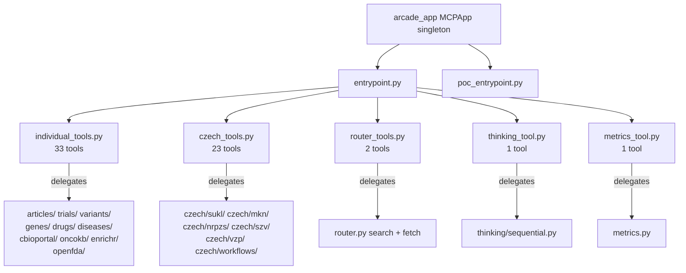

# Arcade Deploy Layer — Deep Exploration

Kompletní analýza Arcade Deploy vrstvy: 60 nástrojů v 5 souborech, architektura thin-wrapper delegace na FastMCP privátní funkce, klíčové SDK rozdíly a deployment flow.

## Architektura

Arcade Deploy vrstva je **thin-wrapper pattern** — každý z 60 nástrojů deleguje na stejnou privátní implementační funkci jako FastMCP server. Žádná duplicitní business logika.

### Distribuce nástrojů (60 celkem)

| Soubor | Počet | Pokrytí |
|--------|-------|---------|
| `individual_tools.py` | 33 | Biomedicínské nástroje (articles, trials, variants, genes, drugs, diseases, cBioPortal, OncoKB, Enrichr, OpenFDA) |
| `czech_tools.py` | 23 | České zdravotnictví (SUKL 8, MKN 4+diagnosis_assist+drug_profile, NRPZS 4, SZV 3, VZP 2) |
| `router_tools.py` | 2 | Unified search + fetch dispatcher (20+ domén) |
| `thinking_tool.py` | 1 | Sequential thinking pro výzkumné plánování |
| `metrics_tool.py` | 1 | Performance metrics report |

### Singleton & Entrypoints

`__init__.py` vytváří `arcade_app = MCPApp(name='czech_med_mcp', version='0.8.0')` — Arcade ekvivalent `core.mcp_app`.

Dva entrypointy:
- **`entrypoint.py`** — full deploy (60 nástrojů), importuje všech 5 wrapper modulů
- **`poc_entrypoint.py`** — PoC deploy (5 nástrojů), ale ve skutečnosti importuje stejné moduly jako full — pravděpodobně pozůstatek, registruje také 60

Oba podporují `stdio` transport (default) i `host/port` HTTP.

### Klíčové SDK rozdíly (Arcade vs FastMCP)

| Aspekt | FastMCP | Arcade |
|--------|---------|--------|
| Dekorátor | `@mcp_app.tool()` (se závorkami) | `@arcade_app.tool` (bez závorek) |
| Parametry | `Annotated[type, Field(description=...)]` | `Annotated[type, "desc"]` |
| Constraints | Pydantic `ge=1, le=100` | Manuální `max(1, min(100, val))` |
| List params | `list[str] \| None` | `str \| None` + `ensure_list(val, split_strings=True)` |
| Return dict | Přímo dict | `json.dumps(result, ensure_ascii=False)` → str |

### Delegation Pattern

Každý wrapper:
1. Přijme parametry s `Annotated[type, "desc"]`
2. Provede manuální clamping (`max(1, page)`, `max(1, min(100, page_size))`)
3. Konvertuje `str` → `list` přes `ensure_list(val, split_strings=True)` kde potřeba
4. Volá privátní `_function()` z doménového modulu
5. Serializuje výsledek do `str` (pokud není již string)

### Router Tools specifika

`router_tools.py` definuje dva Literal typy:
- `DomainLiteral` — 21 domén (article, trial, variant, gene, drug, disease, 6× nci_*, 6× fda_*, sukl_drug, mkn_diagnosis, nrpzs_provider, szv_procedure, vzp_reimbursement)
- `DetailLiteral` — 6 hodnot (protocol, locations, outcomes, references, all, full)

Helper `_clamp()` a `_serialize()` jsou lokální utility.

### Deploy commands

```bash
uv sync --extra arcade                                    # Install SDK
arcade deploy -e src/czechmedmcp/arcade/entrypoint.py      # Full (60)
arcade deploy -e src/czechmedmcp/arcade/poc_entrypoint.py   # PoC (5 intended, 60 actual)
```

## Diagram



### NOTES

- poc_entrypoint.py importuje VŠECHNY moduly stejně jako full entrypoint — komentář říká '5 tools' ale registruje 60. Bug nebo tech debt.
- Arcade SDK nepodporuje Pydantic Field() constraints — všechny ge/le musí být manuální clamping v každém wrapperu.
- List parametry musí být str|None (ne list[str]) kvůli Arcade SDK omezení — konverze přes ensure_list(split_strings=True).
- individual_tools.py je 58KB — největší soubor v arcade/, obsahuje 33 tool wrapperů s rozsáhlými docstringy.
- Version string '0.8.0' je hardcoded v __init__.py — není synchronizován s pyproject.toml.

[[arcadedeploy]]
