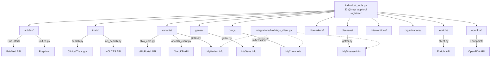

# Biomedical Domain Modules — Deep Exploration

Kompletní analýza 12 doménových modulů poskytujících 33 standardních biomedicínských nástrojů. Moduly pokrývají PubMed, ClinicalTrials.gov, MyVariant.info, OpenFDA (6 endpointů), cBioPortal, OncoKB, NCI CTS, Enrichr a BioThings suite.

## Architektura doménových modulů

### Vzor search.py / getter.py
Každý doménový modul dodržuje konzistentní pattern:
- **search.py** — Pydantic request model + privátní `_*_searcher()` funkce
- **getter.py** — privátní `_*_details()` funkce pro detail entity
- Registrace v `individual_tools.py` přes `@mcp_app.tool()` dekorátor
- Všechny tool funkce vracejí `str` (markdown nebo JSON)

### 33 nástrojů v individual_tools.py
| Doména | Nástroje | Ext. API |
|--------|----------|----------|
| articles/ | article_searcher, article_getter | PubMed/PubTator3 |
| trials/ | trial_searcher, trial_getter, trial_protocol/references/outcomes/locations_getter | ClinicalTrials.gov + NCI CTS |
| variants/ | variant_searcher, variant_getter, alphagenome_predictor | MyVariant.info, cBioPortal, OncoKB, AlphaGenome |
| genes/ | gene_getter | MyGene.info |
| drugs/ | drug_getter | MyChem.info |
| diseases/ | disease_getter | MyDisease.info |
| biomarkers/ | nci_biomarker_searcher | NCI CTS |
| enrichr/ | enrichr_analyzer | Enrichr |
| interventions/ | nci_intervention_searcher, nci_intervention_getter | NCI CTS |
| organizations/ | nci_organization_searcher, nci_organization_getter | NCI CTS |
| openfda/ | 12 nástrojů (adverse, label, device, approval, recall, shortage × search+get) | OpenFDA |
| integrations/ | (podpůrné — BioThings client, CTS API) | BioThings suite |

### Klíčové architekturní detaily

**articles/** — Nejkomplexnější search modul:
- `search.py`: PubTator3 API s autocomplete konceptů (chemicals, diseases, genes, variants)
- `unified.py`: Slučuje PubMed + preprints, DOI-based deduplikace, cBioPortal/OncoKB enrichment
- `fetch.py`: PMC→PMID konverze, detailní article fetch
- `preprints.py`, `autocomplete.py`: Doplňkové moduly

**variants/** — Nejsložitější modul (14 souborů):
- `cbio_core.py` → `CBioPortalCoreClient` base class (gene ID lookup, mutation profiles, batch fetch)
- `cbio_external_client.py` → `CBioPortalExternalClient` (variant enrichment z externích zdrojů)
- `cbioportal_mutations.py` → `CBioPortalMutationClient` (mutace napříč studiemi)
- `cbioportal_search.py` → `CBioPortalSearchClient` (gene-level agregace)
- Všichni 3 klienti dědí z `CBioPortalCoreClient`, používají `CBioHTTPAdapter`
- `oncokb_client.py` + `oncokb_models.py`: OncoKB integrace
- `alphagenome.py`: AlphaGenome prediktor
- `external.py`: Variant enrichment orchestrátor (582+ řádků)

**openfda/** — Self-contained subsystém:
- Vlastní `constants.py`, `exceptions.py`, `rate_limiter.py`, `validation.py`, `input_validation.py`
- 6 endpointů: drug events, labels, enforcement (recalls), drugsfda (approvals), device events, shortages
- Každý endpoint má hlavní modul + `_helpers.py` pro buildery a formátování
- `cache.py` + `utils.py`: Sdílené utility (make_openfda_request, clean_text, truncate_text)

**integrations/** — Podpůrná vrstva:
- `biothings_client.py`: Unified klient pro MyGene, MyVariant, MyDisease, MyChem API
- `cts_api.py`: NCI Chemical Translation Service
- Drug name resolution s fallback extrakcí z query hitů (drugbank → chembl → unii)

## Diagram

### NOTES

- variants/ je nejsložitější modul — 14 souborů, 3 cBioPortal klienti dědící z CBioPortalCoreClient, plus OncoKB a AlphaGenome. Vysoké riziko při refaktoru.
- openfda/ je self-contained subsystém s vlastními exceptions, rate limiter, validation — duplikuje částečně infrastrukturu z hlavního http_client.py
- articles/unified.py provádí cross-domain enrichment (cBioPortal + OncoKB summaries do article výsledků) — implicitní coupling mezi moduly
- individual_tools.py je 1950+ řádků s 33 tool registracemi — kandidát na rozčlenění do per-domain tool files
- NCI CTS API má bucket limit (75000) — speciální error handling v _handle_cts_bucket_error() pro příliš široké dotazy
- trials/search.py obsahuje rozsáhlou query validaci (811+ řádků) s drug name resolution přes BioThings client — tight coupling s integrations/

[[biomedicaldomains]]
