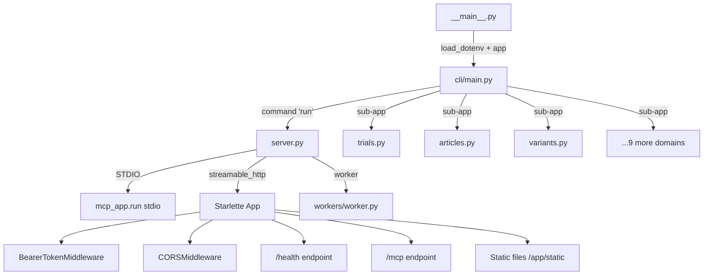

# CLI & Server Modes — Deep Dive

Kompletní analýza CLI modulu: Typer app s 12 doménovými sub-příkazy, 3 serverové režimy (STDIO/HTTP/SSE), Bearer auth middleware, health endpoint, static file serving.

## Architektura

### Entry Point Chain
```
__main__.py → load_dotenv() → cli.app(standalone_mode=True)
cli/__init__.py → re-export app from main.py
cli/main.py → Typer app + 12 sub-apps + run command + version
```

### Soubory (14 modulů)
| Soubor | Účel |
|--------|------|
| `main.py` | Root Typer app, 12 sub-apps, `--version`, `--verbose` |
| `server.py` | `ServerMode` enum, `run_server()` — 3 transport režimy |
| `trials.py` | `get` + `search` příkazy pro ClinicalTrials.gov/NCI |
| `articles.py` | PubMed article search/get |
| `variants.py` | MyVariant.info variant search/get |
| `genes.py` | Gene info |
| `drugs.py` | Drug info |
| `diseases.py` | Disease search |
| `biomarkers.py` | Biomarker search |
| `interventions.py` | Intervention search |
| `organizations.py` | Organization search |
| `openfda.py` | OpenFDA (recalls, labels, adverse events) |
| `czech.py` | České zdravotnické nástroje |
| `health.py` | Health check CLI |

### Serverové režimy

**STDIO** (default): `mcp_app.run(transport='stdio')` — přímé FastMCP volání, pro Claude Desktop.

**Streamable HTTP**: Starlette app z `mcp_app.streamable_http_app()` + middleware stack:
1. `BearerTokenMiddleware` — Bearer token z `MCP_AUTH_TOKEN` env var (min 32 chars, `secrets.compare_digest`)
2. `CORSMiddleware` — allow all origins
3. `/health` GET endpoint (skip auth)
4. `/mcp` — hlavní MCP endpoint
5. Optional static files z `/app/static` (Docker)

**Worker/SSE** (legacy): Import z `workers/worker.py`, **nepodporuje auth** (fail-fast check).

### Auth model (auth.py)
- `validate_auth_token()` — startup validation, min 32 chars
- `BearerTokenMiddleware` — Starlette middleware, skip `/health` + OPTIONS
- Constant-time comparison via `secrets.compare_digest`
- 401 response s `WWW-Authenticate: Bearer` header

### CLI Pattern
Každý doménový modul (trials, articles, ...): Typer sub-app s `get` + `search` příkazy → konstruuje Pydantic query model → `asyncio.run(private_function())` → `typer.echo(result)`.

## Diagram



### NOTES

- Worker mode explicitly rejects MCP_AUTH_TOKEN — fails fast with error message directing to streamable_http
- Static file serving hardcoded to /app/static — Docker-only, won't work in local dev
- All CLI domain commands use asyncio.run() — blocking bridge from sync Typer to async domain functions
- run_server is registered TWICE: once in server_app (unused) and once in main.py via app.command('run') — the server_app Typer is created but never mounted
- CORS is wide open (allow_origins=['*']) — acceptable for MCP protocol but worth noting

## Related

- [coreinfrastructure](coreinfrastructure.md)

[[climodule]]
