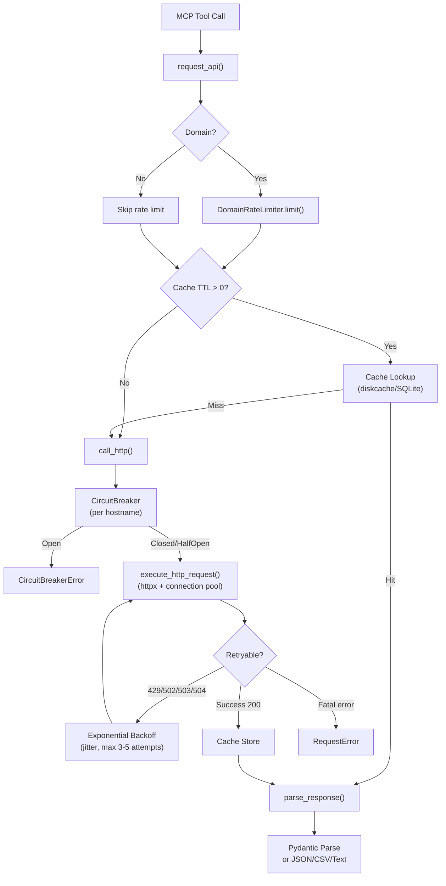

# Core & Infrastructure — Deep Dive

Kompletní analýza infrastrukturní vrstvy CzechMedMCP: FastMCP singleton, HTTP pipeline (cache → rate limit → circuit breaker → retry → parse), metriky, auth middleware, render utilities. 11 klíčových souborů, ~1800 řádků kódu.

## Architektura

Infrastrukturní vrstva poskytuje sdílené služby pro všech 60 MCP nástrojů. Skládá se z těchto komponent:

### 1. FastMCP Singleton (`core.py`, ~100 řádků)
- `mcp_app` — globální FastMCP instance s `stateless_http=True` a vypnutou DNS rebinding ochranou
- `StrEnum` — case-insensitive enum s normalizací mezer/podtržítek
- `ensure_list()` — konverze LLM vstupů (string→list, comma split)
- `PublicationState` enum (preprint/peer_reviewed/unknown)
- Lifespan context manager (prázdný — startup/shutdown hooks)

### 2. HTTP Pipeline (`http_client.py` + `http_client_simple.py`, ~530 řádků)
**Hlavní tok:** `request_api()` → rate limit → cache lookup → `call_http()` → circuit breaker → `execute_http_request()` → retry → cache store → `parse_response()`

- **Cache:** diskcache/SQLite v `~/.cache/czechmedmcp/http_cache`, TTL 1 týden (default), MD5 klíč z method+url+params
- **Connection pooling:** `httpx.AsyncClient` s `max_keepalive=20`, `max_connections=100`, `keepalive_expiry=30s`
- **SSL:** Vlastní SSLContext s certifi CA bundle, podpora TLS version pinning
- **Offline mode:** `BIOMCP_OFFLINE=true` vrací pouze cached odpovědi
- **Parsing:** JSON → Pydantic model, CSV fallback, text fallback

### 3. Circuit Breaker (`circuit_breaker.py`, ~280 řádků)
- Tři stavy: CLOSED → OPEN → HALF_OPEN → CLOSED
- Globální registr breakers per hostname (`_circuit_breakers` dict)
- Konfigurace: failure_threshold=10, recovery_timeout=30s, success_threshold=3
- Dekorátor `@circuit_breaker(name, config)` i třídní API `CircuitBreaker.call()`
- Async lock per instance

### 4. Rate Limiter (`rate_limiter.py`, ~170 řádků)
- **Token bucket** (`RateLimiter`) — per-domain, async acquire s čekáním
- **Domain limiter** (`DomainRateLimiter`) — konfigurace per doména (PubMed 20 rps, OncoKB 5 rps, thinking 50 rps)
- **Sliding window** (`SlidingWindowRateLimiter`) — 1000 req/hour per user
- Globální instance: `domain_limiter`, `user_limiter`

### 5. Retry (`retry.py`, ~250 řádků)
- Exponenciální backoff: `delay = initial * (base ^ attempt)`, max cap, ±10% jitter
- Retryable status codes: 429, 502, 503, 504
- Retryable exceptions: ConnectionError, TimeoutError, OSError
- Default: 3 pokusy, 1s initial, 60s max; Agresivní (pubmed/trials/myvariant): 5 pokusů, 2s initial, 30s max
- `RetryableHTTPError` wrapper pro HTTP status triggering

### 6. Metrics (`metrics.py`, ~400 řádků)
- In-memory `MetricsCollector` s async lock, max 1000 samples per metric
- `MetricSummary` — count, success/error rate, p50/p95/p99 latence
- `@track_performance(name)` dekorátor (async + sync)
- `Timer` context manager (sync + async)
- Toggle: `BIOMCP_METRICS_ENABLED` env var

### 7. Constants (`constants.py`, ~400 řádků)
- 30+ API base URLs (PubMed, ClinicalTrials, MyVariant, SUKL, NRPZS, SZV, OpenFDA, cBioPortal...)
- Cache TTL: DAY/HOUR/WEEK/MONTH
- Pagination: `compute_skip()`, SYSTEM_PAGE_SIZE=10, MAX=100
- Rate limit defaults: 10 rps, burst 20
- Domain mappings: singular↔plural, valid domains list (21 domén)
- Insurance rate table (7 českých pojišťoven)
- Diagnosis→specialty mapping (14 MKN kapitol)

### 8. Exceptions (`exceptions.py`, ~100 řádků)
Strom: `CzechMedMCPError` → `CzechMedMCPSearchError` → `InvalidDomainError` | `InvalidParameterError` | `SearchExecutionError` | `ResultParsingError`
Dále: `QueryParsingError`, `ThinkingError`, `format_tool_error()` helper

### 9. Auth (`auth.py`, ~90 řádků)
- `BearerTokenMiddleware` (Starlette) — `MCP_AUTH_TOKEN` env var, min 32 znaků
- Bypass: /health, OPTIONS (CORS preflight)
- Timing-safe porovnání (`secrets.compare_digest`)

### 10. Render (`render.py`, ~215 řádků)
- `to_markdown()` — JSON/dict/list → Markdown s headings, bullet lists, key-value páry
- Text wrapping na 72 znaků, deduplikace seznamů
- `transform_key()` — camelCase/snake_case → "Title Case"

### 11. Utils (`utils/`, ~12 souborů)
- `endpoint_registry.py` — registr API endpointů pro validaci
- `cbio_http_adapter.py` — HTTP adapter pro cBioPortal
- `gene_validator.py`, `mutation_filter.py`, `query_utils.py`
- `request_cache.py` — request-level cache helper
- Duplikované `retry.py`, `rate_limiter.py`, `metrics.py` v utils/ (viz tech debt)

## Diagram

### NOTES

- Tech debt: utils/ obsahuje duplikáty retry.py, rate_limiter.py, metrics.py — pravděpodobně pozůstatek refaktoru, top-level verze jsou autoritativní
- Cache key používá MD5 (noqa: S324) — kryptograficky slabé, ale pro cache klíče akceptovatelné
- http_client_simple.py má fallback import z ..connection_pool který může selhat — existuje graceful fallback na nový httpx.AsyncClient
- Offline mode kontroluje BIOMCP_OFFLINE env var — legacy název z původního BioMCP forku, mělo by být CZECHMEDMCP_OFFLINE
- METRICS_ENABLED kontroluje BIOMCP_METRICS_ENABLED — stejný legacy naming issue
- CircuitBreaker používá datetime.now() místo monotonic clock — může být ovlivněn systémovými hodinami
- Lifespan v core.py je prázdný (jen yield) — potenciální místo pro pre-warming cache nebo DrugIndex

[[coreinfrastructure]]
