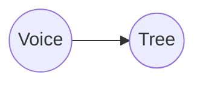
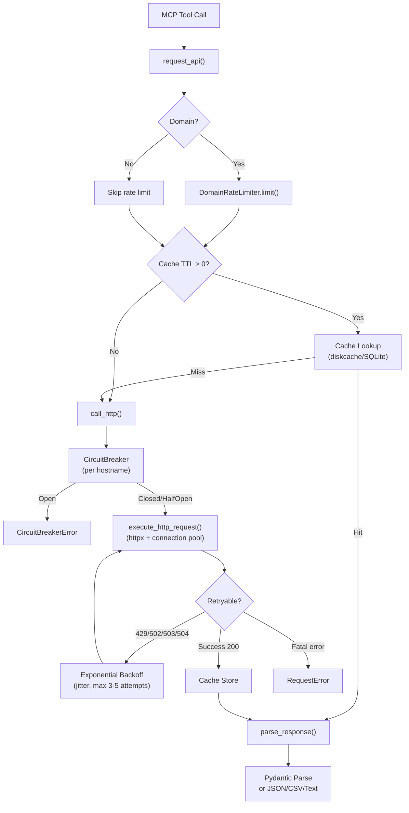
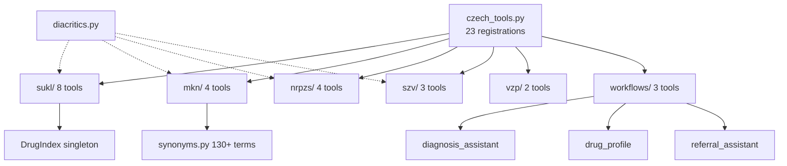
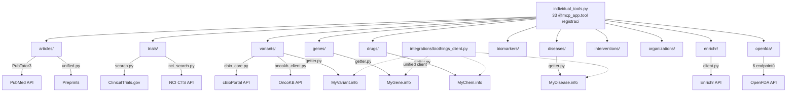
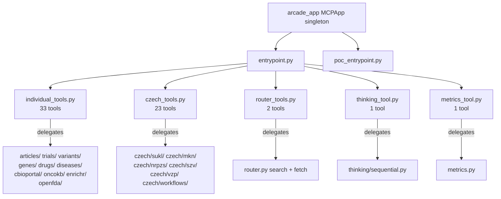
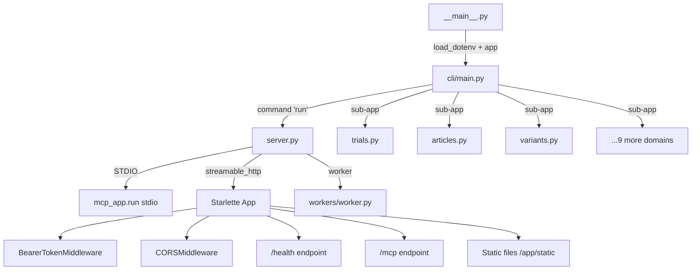
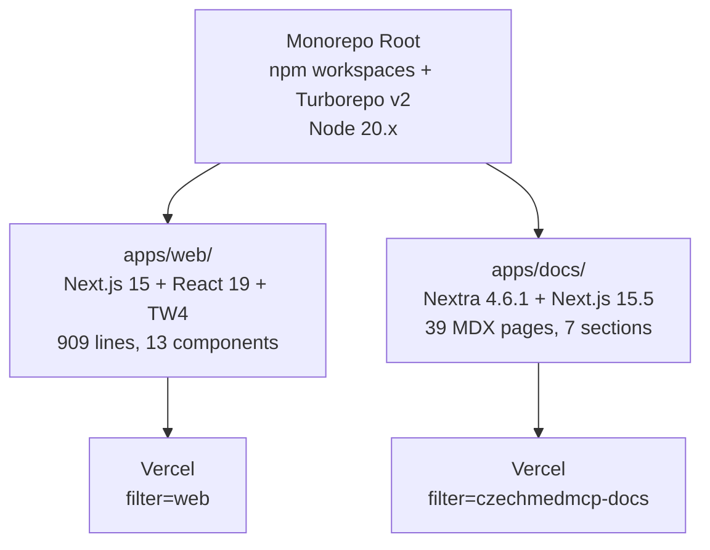
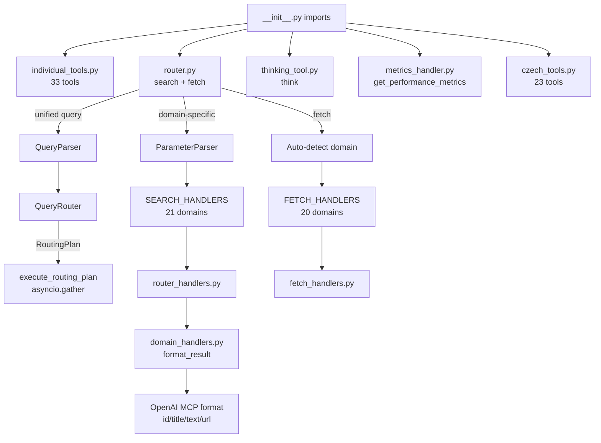

## ASK: 'Komunnikuj primarne česky a yvsvetli my to'
```
Hello
└── Voicetree
    ├── Generate codebase graph (run me)
    └── Hover over me
Core & Infrastructure — Deep Dive
└── Core & Infrastructure
Czech Healthcare Modules — Architecture Overview
└── Czech Healthcare Modules
Biomedical Domain Modules — Deep Exploration
└── Biomedical Domain Modules
Arcade Deploy Layer — Deep Exploration
└── Arcade Deploy Layer
CLI & Server Modes — Deep Dive
└── CLI & Server Modes
Frontend Apps Overview
└── Frontend Apps (Web + Docs)
Router & Tool Registration — Deep Exploration Complete
└── Router & Tool Registration
```

## Node Details
</Users/petrsovadina/Desktop/Develope/personal/CzechMed-MCP/voicetree-28-3/welcome_to.md> [RELEVANT]
 # Hello

welcome to [welcome_to_voicetree.md] 
 <//Users/petrsovadina/Desktop/Develope/personal/CzechMed-MCP/voicetree-28-3/welcome_to.md>
</Users/petrsovadina/Desktop/Develope/personal/CzechMed-MCP/voicetree-28-3/welcome_to_voicetree.md> [RELEVANT]
 # Voicetree

## The spatial IDE for multi-agent orchestration

##### Build massive projects out of hundreds of agent sessions whose outputs are all saved, connected together, and turned into a Markdown mindmap. Spatially navigate the graph to hand-hold agents as they recursively fork themselves.

Optimise for seeing only the most relevant information at the necessary level of abstraction.

ready? [run_me.md]

explore the features [hover_over_me.md] 
 <//Users/petrsovadina/Desktop/Develope/personal/CzechMed-MCP/voicetree-28-3/welcome_to_voicetree.md>
</Users/petrsovadina/Desktop/Develope/personal/CzechMed-MCP/voicetree-28-3/run_me.md> [RELEVANT]
 # Generate codebase graph (run me)

### Your task is to run the following workflow

1. **Quick scan** — identify the top ~7 major modules using lightweight exploration only (glob directory listings, read a few entry points). Do NOT deep-dive into any module. The goal is just module names, root paths, and a one-line purpose each.
2. **Create a skeleton node** for each module containing only:
    - Module name and root path
    - One-line purpose
    - A distinct color per module (submodules inherit color)
3. **Spawn one voicetree agent per module**. Each agent is responsible for:
    - Deep-exploring its module (read key files, trace flows)
    - Updating its parent node with: concise purpose summary, mermaid diagram for core flow, notable gotchas or tech debt
    - Breaking the module down into up to 7 submodule child nodes

There is no need for you or the subagents to create an additional progress node, the module nodes already satisfy this requirement.

## Constraints

- **Max 7 modules** per level
- **Tree structure**: each node links only to its direct parent
- **Depth limit**: subagents do NOT spawn further agents
- **Orchestrator stays lightweight**: do not use explore subagents or read deeply into module internals — delegate that to the per-module agents
 
 <//Users/petrsovadina/Desktop/Develope/personal/CzechMed-MCP/voicetree-28-3/run_me.md>
</Users/petrsovadina/Desktop/Develope/personal/CzechMed-MCP/voicetree-28-3/hover_over_me.md> [RELEVANT]
 # Hover over me

Recommended usage for agentic engineering:

1. Brainstorm a large task in the mindmap itself. Get AI to help review and suggest options as needed.

2. Start executing agents on branches of the brainstorm. For larger/harder parts of the project, Tell agents to "decompose plan into a dependency graph of nodes, and then spawn voicetree agents to work through it"

3. Rotate between the idle agents (cmd + [ keyboard shortcut), to see if they need help or to be nudged towards true completion.

4. Since the feature will never be pixel perfect on the first iteration, for running next steps, spawn agents directly on handover notes automatically created by the previous sessions.

5. Zoom out to see the big picture of the shape of the work you and your agents did, useful for identifying productivity bottlenecks.


### Voicetree features

Above the node editor, you will see 6 buttons, these are all the actions you can perform on a node. Try adding a child node now.

Markdown support:

**Code blocks:**
```typescript
while (true) {
+  const x : string = "Hello World!"
-  // agents will automatically produce handover nodes with their diff  
  ...
}
```

**Mermaid diagram blocks:**


You can add edges to other nodes by typing a wikilink. Start typing double square brackets, and an autocomplete will pop up, to insert links to another nodes path like so: [to_the_other_nodes_relative_or_absolute_path.md]]

# Hotkeys & other features

### Navigation
- Hold **space** to follow most recent node
- **Cmd + ] or [** to cycle between terminals
- **Cmd + 1-5** to navigate to recently added or modified nodes (appear as tabs in the top left)
- **Cmd + E** to open the graph search / command pallete (nodes here are ordererd by recently selected), cmd + f, cmd + k also work

## Markdown nodes
- **Cmd + drag** to select nodes. Hover also selects node.
- **Cmd + n** to create new child node, or if no node is selected, creates orphan node
- **Cmd + backspace** to delete selected node(s)
- **Cmd + enter** to run this node the default agent (first agent in the agents array in settings.json)
- **Cmd + z** / **cmd + shift + z** to undo / redo 
- **Cmd + w** to close terminals and editors

- when a node is selected, you can speak directly into it! A chip with transcribed text will appear

### Settings
All settings are currently contained in the settings.json file (`~/Library/Application\ Support/VoiceTree/settings.json`) 

You can open the editor for this file in the floating menu on the right hand side of the graph.

### Agents

Agents can add nodes via their filesystem tools, since nodes are just markdown files. For example, you can tell agents to 'add a progress tree to the graph'

You can create custom agents in the settings

For example, you could create a "fix broken tests agent", which has a custom CLI command and prompt. 


#### Context nodes
When you run an agent, it will produce a context node, this is a traversal of nodes within distance=6 (configurable in the settings)
This is the context that will be injected into the agent at startup.

#### Works amazingly with spec driven development
VoiceTree pairs perfectly with OpenSpec for AI-assisted development.

Just tell your agent: "Please create an OpenSpec change proposal for this feature" - the markdown files will appear in the graph.
Works Amazingly With OpenSpec
VoiceTree pairs perfectly with OpenSpec for AI-assisted development.

Just tell your agent: "Please create an OpenSpec change proposal for this feature" - the markdown files will appear in the graph.

[[to_the_other_nodes_relative_or_absolute_path.md]
[to_the_other_nodes_relative_or_absolute_path.md] 
 <//Users/petrsovadina/Desktop/Develope/personal/CzechMed-MCP/voicetree-28-3/hover_over_me.md>
</Users/petrsovadina/Desktop/Develope/personal/CzechMed-MCP/voicetree-28-3/core-infrastructure-deepdive.md>
 # Core & Infrastructure — Deep Dive

Kompletní analýza infrastrukturní vrstvy CzechMedMCP: FastMCP singleton, HTTP pipeline (cache → rate limit → circuit breaker → retry → parse), metriky, auth middleware, render utilities. 11 klíčových souborů, ~1800 řádků kódu.

## Architektura

Infrastrukturní vrstva poskytuje sdílené služby pro všech 60 MCP nástrojů. Skládá se z těchto komponent:

### 1. FastMCP Singleton (`core.py`, ~100 řádků)
- `mcp_app` — globální FastMCP instance s `stateless_http=True` a vypnutou DNS rebinding ochranou
- `StrEnum` — case-insensitive enum s normalizací mezer/podtržítek
- `ensure_list()` — konverze LLM vstupů (string→list, comma split)
- `PublicationState` enum (preprint/peer_reviewed/unknown)
- Lifespan context manager (prázdný — startup/shutdown hooks)

### 2. HTTP Pipeline (`http_client.py` + `http_client_simple.py`, ~530 řádků)
**Hlavní tok:** `request_api()` → rate limit → cache lookup → `call_http()` → circuit breaker → `execute_http_request()` → retry → cache store → `parse_response()`

- **Cache:** diskcache/SQLite v `~/.cache/czechmedmcp/http_cache`, TTL 1 týden (default), MD5 klíč z method+url+params
- **Connection pooling:** `httpx.AsyncClient` s `max_keepalive=20`, `max_connections=100`, `keepalive_expiry=30s`
- **SSL:** Vlastní SSLContext s certifi CA bundle, podpora TLS version pinning
- **Offline mode:** `BIOMCP_OFFLINE=true` vrací pouze cached odpovědi
- **Parsing:** JSON → Pydantic model, CSV fallback, text fallback

### 3. Circuit Breaker (`circuit_breaker.py`, ~280 řádků)
- Tři stavy: CLOSED → OPEN → HALF_OPEN → CLOSED
- Globální registr breakers per hostname (`_circuit_breakers` dict)
- Konfigurace: failure_threshold=10, recovery_timeout=30s, success_threshold=3
- Dekorátor `@circuit_breaker(name, config)` i třídní API `CircuitBreaker.call()`
- Async lock per instance

### 4. Rate Limiter (`rate_limiter.py`, ~170 řádků)
- **Token bucket** (`RateLimiter`) — per-domain, async acquire s čekáním
- **Domain limiter** (`DomainRateLimiter`) — konfigurace per doména (PubMed 20 rps, OncoKB 5 rps, thinking 50 rps)
- **Sliding window** (`SlidingWindowRateLimiter`) — 1000 req/hour per user
- Globální instance: `domain_limiter`, `user_limiter`

### 5. Retry (`retry.py`, ~250 řádků)
- Exponenciální backoff: `delay = initial * (base ^ attempt)`, max cap, ±10% jitter
- Retryable status codes: 429, 502, 503, 504
- Retryable exceptions: ConnectionError, TimeoutError, OSError
- Default: 3 pokusy, 1s initial, 60s max; Agresivní (pubmed/trials/myvariant): 5 pokusů, 2s initial, 30s max
- `RetryableHTTPError` wrapper pro HTTP status triggering

### 6. Metrics (`metrics.py`, ~400 řádků)
- In-memory `MetricsCollector` s async lock, max 1000 samples per metric
- `MetricSummary` — count, success/error rate, p50/p95/p99 latence
- `@track_performance(name)` dekorátor (async + sync)
- `Timer` context manager (sync + async)
- Toggle: `BIOMCP_METRICS_ENABLED` env var

### 7. Constants (`constants.py`, ~400 řádků)
- 30+ API base URLs (PubMed, ClinicalTrials, MyVariant, SUKL, NRPZS, SZV, OpenFDA, cBioPortal...)
- Cache TTL: DAY/HOUR/WEEK/MONTH
- Pagination: `compute_skip()`, SYSTEM_PAGE_SIZE=10, MAX=100
- Rate limit defaults: 10 rps, burst 20
- Domain mappings: singular↔plural, valid domains list (21 domén)
- Insurance rate table (7 českých pojišťoven)
- Diagnosis→specialty mapping (14 MKN kapitol)

### 8. Exceptions (`exceptions.py`, ~100 řádků)
Strom: `CzechMedMCPError` → `CzechMedMCPSearchError` → `InvalidDomainError` | `InvalidParameterError` | `SearchExecutionError` | `ResultParsingError`
Dále: `QueryParsingError`, `ThinkingError`, `format_tool_error()` helper

### 9. Auth (`auth.py`, ~90 řádků)
- `BearerTokenMiddleware` (Starlette) — `MCP_AUTH_TOKEN` env var, min 32 znaků
- Bypass: /health, OPTIONS (CORS preflight)
- Timing-safe porovnání (`secrets.compare_digest`)

### 10. Render (`render.py`, ~215 řádků)
- `to_markdown()` — JSON/dict/list → Markdown s headings, bullet lists, key-value páry
- Text wrapping na 72 znaků, deduplikace seznamů
- `transform_key()` — camelCase/snake_case → "Title Case"

### 11. Utils (`utils/`, ~12 souborů)
- `endpoint_registry.py` — registr API endpointů pro validaci
- `cbio_http_adapter.py` — HTTP adapter pro cBioPortal
- `gene_validator.py`, `mutation_filter.py`, `query_utils.py`
- `request_cache.py` — request-level cache helper
- Duplikované `retry.py`, `rate_limiter.py`, `metrics.py` v utils/ (viz tech debt)

## Diagram



### NOTES

- Tech debt: utils/ obsahuje duplikáty retry.py, rate_limiter.py, metrics.py — pravděpodobně pozůstatek refaktoru, top-level verze jsou autoritativní
- Cache key používá MD5 (noqa: S324) — kryptograficky slabé, ale pro cache klíče akceptovatelné
- http_client_simple.py má fallback import z ..connection_pool který může selhat — existuje graceful fallback na nový httpx.AsyncClient
- Offline mode kontroluje BIOMCP_OFFLINE env var — legacy název z původního BioMCP forku, mělo by být CZECHMEDMCP_OFFLINE
- METRICS_ENABLED kontroluje BIOMCP_METRICS_ENABLED — stejný legacy naming issue
- CircuitBreaker používá datetime.now() místo monotonic clock — může být ovlivněn systémovými hodinami
- Lifespan v core.py je prázdný (jen yield) — potenciální místo pro pre-warming cache nebo DrugIndex

[coreinfrastructure]
 
 <//Users/petrsovadina/Desktop/Develope/personal/CzechMed-MCP/voicetree-28-3/core-infrastructure-deepdive.md>
</Users/petrsovadina/Desktop/Develope/personal/CzechMed-MCP/voicetree-28-3/coreinfrastructure.md>
 # Core & Infrastructure

Základní vrstva: FastMCP singleton, HTTP klient s cache/retry/circuit breaker, konstanty, výjimky, rate limiter, connection pool, utils.

**Root path:** `src/czechmedmcp/` (top-level .py files) + `src/czechmedmcp/utils/`

**Key files:** core.py, constants.py, exceptions.py, http_client.py, auth.py, circuit_breaker.py, connection_pool.py, rate_limiter.py, retry.py, render.py, metrics.py

**Purpose:** Sdílená infrastruktura pro všechny doménové moduly — HTTP pipeline (cache → circuit breaker → retry → parse), FastMCP app singleton, Pydantic helpers, markdown rendering.

[welcome_to_voicetree]
 
 <//Users/petrsovadina/Desktop/Develope/personal/CzechMed-MCP/voicetree-28-3/coreinfrastructure.md>
</Users/petrsovadina/Desktop/Develope/personal/CzechMed-MCP/voicetree-28-3/czech-overview.md>
 # Czech Healthcare Modules — Architecture Overview

23 MCP nástrojů v 6 submodulech + 3 workflow orchestrátory. Všechny sdílí lazy-init vzor s diskcache a diacritics-insensitive search.

## Architektura (23 nástrojů, `src/czechmedmcp/czech/`)

| Submodul | Nástroje | Datový zdroj | Init vzor |
|----------|----------|--------------|----------|
| **sukl/** | 8 | SUKL DLP API (REST) | Lazy DrugIndex singleton (~46K entries, ~14MB) |
| **mkn/** | 4 | ÚZIS CSV open data | In-memory LRU (~20MB), synonym dict |
| **nrpzs/** | 4 | ÚZIS CSV open data | In-memory list, diskcache raw CSV |
| **szv/** | 3 | MZ ČR Excel (openpyxl) | In-memory list, 1-day cache |
| **vzp/** | 2 | Via SUKL DrugIndex | Sdílí SUKL init |
| **workflows/** | 3 | Orchestrace ostatních | Žádný vlastní state |

### Registrace
Všech 23 v `czech_tools.py` přes `@mcp_app.tool()` s prefixem `czechmed_`. Tenké wrappery delegují na privátní `_function()`. SUKL tools mají `asyncio.wait_for()` timeout.

### Sdílená infrastruktura
- **diacritics.py**: NFD normalization → strip combining marks → lowercase. Použito všude.
- **response.py**: Dual output (`content` Markdown + `structuredContent` dict) dle FR-025.
- Všechny modules: module-level `None` sentinel → lazy async init → diskcache → in-memory.

## Diagram



[czechhealthcare]
 
 <//Users/petrsovadina/Desktop/Develope/personal/CzechMed-MCP/voicetree-28-3/czech-overview.md>
</Users/petrsovadina/Desktop/Develope/personal/CzechMed-MCP/voicetree-28-3/czechhealthcare.md>
 # Czech Healthcare Modules

23 nástrojů pro české zdravotnictví — SUKL (léky, lékárny), MKN-10 (diagnózy), NRPZS (poskytovatelé), SZV (výkony), VZP (úhrady), diagnosis assist.

**Root path:** `src/czechmedmcp/czech/`

**Submodules:** sukl/ (DrugIndex, DLP API), mkn/ (ICD-10 CZ, synonymy, stats), nrpzs/ (registr poskytovatelů), szv/ (seznam výkonů), vzp/ (úhrady), diagnosis_embed/ (FAISS embeddings), workflows/ (diagnosis_assistant, referral_assist)

**Purpose:** Propojení AI asistentů s českými zdravotnickými registry a databázemi. SUKL DrugIndex = in-memory index 68K léků.

[welcome_to_voicetree]
 
 <//Users/petrsovadina/Desktop/Develope/personal/CzechMed-MCP/voicetree-28-3/czechhealthcare.md>
</Users/petrsovadina/Desktop/Develope/personal/CzechMed-MCP/voicetree-28-3/biomedicaldomainsdeepdive.md>
 # Biomedical Domain Modules — Deep Exploration

Kompletní analýza 12 doménových modulů poskytujících 33 standardních biomedicínských nástrojů. Moduly pokrývají PubMed, ClinicalTrials.gov, MyVariant.info, OpenFDA (6 endpointů), cBioPortal, OncoKB, NCI CTS, Enrichr a BioThings suite.

## Architektura doménových modulů

### Vzor search.py / getter.py
Každý doménový modul dodržuje konzistentní pattern:
- **search.py** — Pydantic request model + privátní `_*_searcher()` funkce
- **getter.py** — privátní `_*_details()` funkce pro detail entity
- Registrace v `individual_tools.py` přes `@mcp_app.tool()` dekorátor
- Všechny tool funkce vracejí `str` (markdown nebo JSON)

### 33 nástrojů v individual_tools.py
| Doména | Nástroje | Ext. API |
|--------|----------|----------|
| articles/ | article_searcher, article_getter | PubMed/PubTator3 |
| trials/ | trial_searcher, trial_getter, trial_protocol/references/outcomes/locations_getter | ClinicalTrials.gov + NCI CTS |
| variants/ | variant_searcher, variant_getter, alphagenome_predictor | MyVariant.info, cBioPortal, OncoKB, AlphaGenome |
| genes/ | gene_getter | MyGene.info |
| drugs/ | drug_getter | MyChem.info |
| diseases/ | disease_getter | MyDisease.info |
| biomarkers/ | nci_biomarker_searcher | NCI CTS |
| enrichr/ | enrichr_analyzer | Enrichr |
| interventions/ | nci_intervention_searcher, nci_intervention_getter | NCI CTS |
| organizations/ | nci_organization_searcher, nci_organization_getter | NCI CTS |
| openfda/ | 12 nástrojů (adverse, label, device, approval, recall, shortage × search+get) | OpenFDA |
| integrations/ | (podpůrné — BioThings client, CTS API) | BioThings suite |

### Klíčové architekturní detaily

**articles/** — Nejkomplexnější search modul:
- `search.py`: PubTator3 API s autocomplete konceptů (chemicals, diseases, genes, variants)
- `unified.py`: Slučuje PubMed + preprints, DOI-based deduplikace, cBioPortal/OncoKB enrichment
- `fetch.py`: PMC→PMID konverze, detailní article fetch
- `preprints.py`, `autocomplete.py`: Doplňkové moduly

**variants/** — Nejsložitější modul (14 souborů):
- `cbio_core.py` → `CBioPortalCoreClient` base class (gene ID lookup, mutation profiles, batch fetch)
- `cbio_external_client.py` → `CBioPortalExternalClient` (variant enrichment z externích zdrojů)
- `cbioportal_mutations.py` → `CBioPortalMutationClient` (mutace napříč studiemi)
- `cbioportal_search.py` → `CBioPortalSearchClient` (gene-level agregace)
- Všichni 3 klienti dědí z `CBioPortalCoreClient`, používají `CBioHTTPAdapter`
- `oncokb_client.py` + `oncokb_models.py`: OncoKB integrace
- `alphagenome.py`: AlphaGenome prediktor
- `external.py`: Variant enrichment orchestrátor (582+ řádků)

**openfda/** — Self-contained subsystém:
- Vlastní `constants.py`, `exceptions.py`, `rate_limiter.py`, `validation.py`, `input_validation.py`
- 6 endpointů: drug events, labels, enforcement (recalls), drugsfda (approvals), device events, shortages
- Každý endpoint má hlavní modul + `_helpers.py` pro buildery a formátování
- `cache.py` + `utils.py`: Sdílené utility (make_openfda_request, clean_text, truncate_text)

**integrations/** — Podpůrná vrstva:
- `biothings_client.py`: Unified klient pro MyGene, MyVariant, MyDisease, MyChem API
- `cts_api.py`: NCI Chemical Translation Service
- Drug name resolution s fallback extrakcí z query hitů (drugbank → chembl → unii)

## Diagram



### NOTES

- variants/ je nejsložitější modul — 14 souborů, 3 cBioPortal klienti dědící z CBioPortalCoreClient, plus OncoKB a AlphaGenome. Vysoké riziko při refaktoru.
- openfda/ je self-contained subsystém s vlastními exceptions, rate limiter, validation — duplikuje částečně infrastrukturu z hlavního http_client.py
- articles/unified.py provádí cross-domain enrichment (cBioPortal + OncoKB summaries do article výsledků) — implicitní coupling mezi moduly
- individual_tools.py je 1950+ řádků s 33 tool registracemi — kandidát na rozčlenění do per-domain tool files
- NCI CTS API má bucket limit (75000) — speciální error handling v _handle_cts_bucket_error() pro příliš široké dotazy
- trials/search.py obsahuje rozsáhlou query validaci (811+ řádků) s drug name resolution přes BioThings client — tight coupling s integrations/

[biomedicaldomains]
 
 <//Users/petrsovadina/Desktop/Develope/personal/CzechMed-MCP/voicetree-28-3/biomedicaldomainsdeepdive.md>
</Users/petrsovadina/Desktop/Develope/personal/CzechMed-MCP/voicetree-28-3/biomedicaldomains.md>
 # Biomedical Domain Modules

Doménové moduly pro PubMed články, klinické studie, varianty, geny, léky, nemoci, biomarkery, OpenFDA, Enrichr, cBioPortal.

**Root path:** `src/czechmedmcp/` — articles/, trials/, variants/, genes/, drugs/, diseases/, biomarkers/, enrichr/, interventions/, organizations/, openfda/, integrations/

**Purpose:** 33 standardních biomedicínských nástrojů přistupujících k PubMed, ClinicalTrials.gov, MyVariant.info, OpenFDA, cBioPortal, OncoKB, NCI, Enrichr. Každý modul má search.py + getter.py pattern.

[welcome_to_voicetree]
 
 <//Users/petrsovadina/Desktop/Develope/personal/CzechMed-MCP/voicetree-28-3/biomedicaldomains.md>
</Users/petrsovadina/Desktop/Develope/personal/CzechMed-MCP/voicetree-28-3/arcade-deploy-deep-dive.md>
 # Arcade Deploy Layer — Deep Exploration

Kompletní analýza Arcade Deploy vrstvy: 60 nástrojů v 5 souborech, architektura thin-wrapper delegace na FastMCP privátní funkce, klíčové SDK rozdíly a deployment flow.

## Architektura

Arcade Deploy vrstva je **thin-wrapper pattern** — každý z 60 nástrojů deleguje na stejnou privátní implementační funkci jako FastMCP server. Žádná duplicitní business logika.

### Distribuce nástrojů (60 celkem)

| Soubor | Počet | Pokrytí |
|--------|-------|---------|
| `individual_tools.py` | 33 | Biomedicínské nástroje (articles, trials, variants, genes, drugs, diseases, cBioPortal, OncoKB, Enrichr, OpenFDA) |
| `czech_tools.py` | 23 | České zdravotnictví (SUKL 8, MKN 4+diagnosis_assist+drug_profile, NRPZS 4, SZV 3, VZP 2) |
| `router_tools.py` | 2 | Unified search + fetch dispatcher (20+ domén) |
| `thinking_tool.py` | 1 | Sequential thinking pro výzkumné plánování |
| `metrics_tool.py` | 1 | Performance metrics report |

### Singleton & Entrypoints

`__init__.py` vytváří `arcade_app = MCPApp(name='czech_med_mcp', version='0.8.0')` — Arcade ekvivalent `core.mcp_app`.

Dva entrypointy:
- **`entrypoint.py`** — full deploy (60 nástrojů), importuje všech 5 wrapper modulů
- **`poc_entrypoint.py`** — PoC deploy (5 nástrojů), ale ve skutečnosti importuje stejné moduly jako full — pravděpodobně pozůstatek, registruje také 60

Oba podporují `stdio` transport (default) i `host/port` HTTP.

### Klíčové SDK rozdíly (Arcade vs FastMCP)

| Aspekt | FastMCP | Arcade |
|--------|---------|--------|
| Dekorátor | `@mcp_app.tool()` (se závorkami) | `@arcade_app.tool` (bez závorek) |
| Parametry | `Annotated[type, Field(description=...)]` | `Annotated[type, "desc"]` |
| Constraints | Pydantic `ge=1, le=100` | Manuální `max(1, min(100, val))` |
| List params | `list[str] \| None` | `str \| None` + `ensure_list(val, split_strings=True)` |
| Return dict | Přímo dict | `json.dumps(result, ensure_ascii=False)` → str |

### Delegation Pattern

Každý wrapper:
1. Přijme parametry s `Annotated[type, "desc"]`
2. Provede manuální clamping (`max(1, page)`, `max(1, min(100, page_size))`)
3. Konvertuje `str` → `list` přes `ensure_list(val, split_strings=True)` kde potřeba
4. Volá privátní `_function()` z doménového modulu
5. Serializuje výsledek do `str` (pokud není již string)

### Router Tools specifika

`router_tools.py` definuje dva Literal typy:
- `DomainLiteral` — 21 domén (article, trial, variant, gene, drug, disease, 6× nci_*, 6× fda_*, sukl_drug, mkn_diagnosis, nrpzs_provider, szv_procedure, vzp_reimbursement)
- `DetailLiteral` — 6 hodnot (protocol, locations, outcomes, references, all, full)

Helper `_clamp()` a `_serialize()` jsou lokální utility.

### Deploy commands

```bash
uv sync --extra arcade                                    # Install SDK
arcade deploy -e src/czechmedmcp/arcade/entrypoint.py      # Full (60)
arcade deploy -e src/czechmedmcp/arcade/poc_entrypoint.py   # PoC (5 intended, 60 actual)
```

## Diagram



### NOTES

- poc_entrypoint.py importuje VŠECHNY moduly stejně jako full entrypoint — komentář říká '5 tools' ale registruje 60. Bug nebo tech debt.
- Arcade SDK nepodporuje Pydantic Field() constraints — všechny ge/le musí být manuální clamping v každém wrapperu.
- List parametry musí být str|None (ne list[str]) kvůli Arcade SDK omezení — konverze přes ensure_list(split_strings=True).
- individual_tools.py je 58KB — největší soubor v arcade/, obsahuje 33 tool wrapperů s rozsáhlými docstringy.
- Version string '0.8.0' je hardcoded v __init__.py — není synchronizován s pyproject.toml.

[arcadedeploy]
 
 <//Users/petrsovadina/Desktop/Develope/personal/CzechMed-MCP/voicetree-28-3/arcade-deploy-deep-dive.md>
</Users/petrsovadina/Desktop/Develope/personal/CzechMed-MCP/voicetree-28-3/arcadedeploy.md>
 # Arcade Deploy Layer

Paralelní deployment wrappery pro Arcade Cloud — 60 nástrojů delegujících na stejné privátní implementace jako FastMCP.

**Root path:** `src/czechmedmcp/arcade/`

**Key files:** entrypoint.py, poc_entrypoint.py, individual_tools.py, czech_tools.py, router_tools.py, thinking_tool.py

**Purpose:** Arcade-MCP-Server SDK wrappery. Klíčové rozdíly: @arcade_app.tool (bez závorek), Annotated[type, 'desc'] místo Field(), manuální clamping místo Pydantic constraints.

[welcome_to_voicetree]
 
 <//Users/petrsovadina/Desktop/Develope/personal/CzechMed-MCP/voicetree-28-3/arcadedeploy.md>
</Users/petrsovadina/Desktop/Develope/personal/CzechMed-MCP/voicetree-28-3/clideepdive.md>
 # CLI & Server Modes — Deep Dive

Kompletní analýza CLI modulu: Typer app s 12 doménovými sub-příkazy, 3 serverové režimy (STDIO/HTTP/SSE), Bearer auth middleware, health endpoint, static file serving.

## Architektura

### Entry Point Chain
```
__main__.py → load_dotenv() → cli.app(standalone_mode=True)
cli/__init__.py → re-export app from main.py
cli/main.py → Typer app + 12 sub-apps + run command + version
```

### Soubory (14 modulů)
| Soubor | Účel |
|--------|------|
| `main.py` | Root Typer app, 12 sub-apps, `--version`, `--verbose` |
| `server.py` | `ServerMode` enum, `run_server()` — 3 transport režimy |
| `trials.py` | `get` + `search` příkazy pro ClinicalTrials.gov/NCI |
| `articles.py` | PubMed article search/get |
| `variants.py` | MyVariant.info variant search/get |
| `genes.py` | Gene info |
| `drugs.py` | Drug info |
| `diseases.py` | Disease search |
| `biomarkers.py` | Biomarker search |
| `interventions.py` | Intervention search |
| `organizations.py` | Organization search |
| `openfda.py` | OpenFDA (recalls, labels, adverse events) |
| `czech.py` | České zdravotnické nástroje |
| `health.py` | Health check CLI |

### Serverové režimy

**STDIO** (default): `mcp_app.run(transport='stdio')` — přímé FastMCP volání, pro Claude Desktop.

**Streamable HTTP**: Starlette app z `mcp_app.streamable_http_app()` + middleware stack:
1. `BearerTokenMiddleware` — Bearer token z `MCP_AUTH_TOKEN` env var (min 32 chars, `secrets.compare_digest`)
2. `CORSMiddleware` — allow all origins
3. `/health` GET endpoint (skip auth)
4. `/mcp` — hlavní MCP endpoint
5. Optional static files z `/app/static` (Docker)

**Worker/SSE** (legacy): Import z `workers/worker.py`, **nepodporuje auth** (fail-fast check).

### Auth model (auth.py)
- `validate_auth_token()` — startup validation, min 32 chars
- `BearerTokenMiddleware` — Starlette middleware, skip `/health` + OPTIONS
- Constant-time comparison via `secrets.compare_digest`
- 401 response s `WWW-Authenticate: Bearer` header

### CLI Pattern
Každý doménový modul (trials, articles, ...): Typer sub-app s `get` + `search` příkazy → konstruuje Pydantic query model → `asyncio.run(private_function())` → `typer.echo(result)`.

## Diagram



### NOTES

- Worker mode explicitly rejects MCP_AUTH_TOKEN — fails fast with error message directing to streamable_http
- Static file serving hardcoded to /app/static — Docker-only, won't work in local dev
- All CLI domain commands use asyncio.run() — blocking bridge from sync Typer to async domain functions
- run_server is registered TWICE: once in server_app (unused) and once in main.py via app.command('run') — the server_app Typer is created but never mounted
- CORS is wide open (allow_origins=['*']) — acceptable for MCP protocol but worth noting

## Related

- [coreinfrastructure](coreinfrastructure.md)

[climodule]
 
 <//Users/petrsovadina/Desktop/Develope/personal/CzechMed-MCP/voicetree-28-3/clideepdive.md>
</Users/petrsovadina/Desktop/Develope/personal/CzechMed-MCP/voicetree-28-3/climodule.md>
 # CLI & Server Modes

Typer CLI app se třemi serverovými režimy (stdio, streamable_http, worker) a doménovými sub-příkazy.

**Root path:** `src/czechmedmcp/cli/`

**Key files:** server.py, __init__.py + per-domain CLI subcommands

**Purpose:** Entry point přes __main__.py → Typer app. Tři režimy: STDIO (Claude Desktop), HTTP endpoint (Railway), Legacy SSE worker.

[welcome_to_voicetree]
 
 <//Users/petrsovadina/Desktop/Develope/personal/CzechMed-MCP/voicetree-28-3/climodule.md>
</Users/petrsovadina/Desktop/Develope/personal/CzechMed-MCP/voicetree-28-3/frontend-overview.md>
 # Frontend Apps Overview

CzechMed-MCP má 2 frontend apps: Next.js 15 landing page (apps/web/) a Nextra 4 dokumentaci (apps/docs/). Obě staticky exportované (`output: 'export'`), deploynuté na Vercel, orchestrované Turborepo v2. Node 20.x pinováno kvůli @napi-rs/simple-git bug.

## Monorepo Orchestration

**Root:** npm workspaces (`apps/*`, `packages/*`) + Turborepo v2, npm 10.9.2

| turbo.json task | dependsOn | outputs | cache |
|-----------------|-----------|---------|-------|
| `build` | `[^build]` | `.next/**, out/**` | yes |
| `dev` | — | — | false, persistent |
| `lint` | `[^build]` | — | yes |

**npm scripts:** `dev:web` (`--filter=web`), `dev:docs` (`--filter=czechmedmcp-docs`), `build:web`, `build:docs`

### Vercel Deploy Strategy
- **Web:** `installCommand: "npm install"`, `buildCommand: "npx turbo build --filter=web"`
- **Docs:** `installCommand: "cd ../.. && npm install"`, `buildCommand: "cd ../.. && npx turbo build --filter=czechmedmcp-docs"` (naviguje do monorepo root)
- Každá app má vlastní `vercel.json`, framework: nextjs

### Key URLs
- Docs: `https://czech-med-mcp-docs.vercel.app`
- GitHub: `https://github.com/petrsovadina/CzechMedMCP`

## Diagram



### NOTES

- Node 20.x PINOVÁNO — Node 24 má bug s @napi-rs/simple-git native bindings
- apps/docs má vlastní package-lock.json (247KB) — možný dependency drift
- Obě apps jsou čistě statické exporty (`output: 'export'`), žádné API routes
- apps/docs explicitně pinuje `@napi-rs/simple-git-linux-x64-gnu: 0.1.19` pro Vercel build
- Web app nemá `next.config` — čistý default Next.js 15, Tailwind 4 via `@tailwindcss/postcss`
- Zero shared packages v `packages/` — obě apps jsou nezávislé

[frontendapps]
 
 <//Users/petrsovadina/Desktop/Develope/personal/CzechMed-MCP/voicetree-28-3/frontend-overview.md>
</Users/petrsovadina/Desktop/Develope/personal/CzechMed-MCP/voicetree-28-3/frontendapps.md>
 # Frontend Apps (Web + Docs)

Next.js 15 landing page (apps/web/) a Nextra 4 dokumentace (apps/docs/) v Turborepo monorepu.

**Root path:** `apps/web/` + `apps/docs/`

**Tech:** Next.js 15, React 19, Nextra 4, Tailwind, Turborepo orchestrace

**Purpose:** Landing page pro CzechMedMCP projekt a interaktivní dokumentace. Deploy na Vercel. Node 20.x (pinováno kvůli @napi-rs/simple-git bug).

[welcome_to_voicetree]
 
 <//Users/petrsovadina/Desktop/Develope/personal/CzechMed-MCP/voicetree-28-3/frontendapps.md>
</Users/petrsovadina/Desktop/Develope/personal/CzechMed-MCP/voicetree-28-3/routertoolsdeepdive.md>
 # Router & Tool Registration — Deep Exploration Complete

Deep-explored the Router & Tool Registration module (6,575 lines across 10 files). Mapped the full tool registration pipeline (60 tools from 5 registration points), two search modes (unified query language + domain-specific dispatch), fetch auto-detection, and 21 supported domains. Updated the task node with architecture diagram, file-level breakdown, and identified 5 tech debt items.

## Architecture Overview

The module is the central nervous system of CzechMedMCP — it registers all 60 MCP tools and provides the unified search/fetch dispatcher.

### Tool Registration Pipeline
```
__init__.py imports → @mcp_app.tool() decorator in 5 files
  individual_tools.py  → 33 tools (articles, trials, variants, genes, drugs, diseases, NCI×4, FDA×6, enrichr, cbioportal, oncokb)
  router.py            → 2 tools (search, fetch) — unified dispatcher
  thinking_tool.py     → 1 tool (think) — sequential reasoning
  metrics_handler.py   → 1 tool (get_performance_metrics)
  czech/czech_tools.py → 23 tools (SUKL, MKN, NRPZS, SZV, VZP, diagnosis, referral)
```

### Search Dispatch Architecture
Two modes coexist in `search()`:
1. **Unified**: query with field syntax (`gene:BRAF AND disease:melanoma`) → QueryParser → QueryRouter → parallel asyncio.gather across domains
2. **Domain-specific**: explicit domain + params → ParameterParser → SEARCH_HANDLERS dispatch dict (21 handlers in router_handlers.py)

The mode selection heuristic checks for `:`, `AND`, `OR` markers in the query string. NCI domains force domain-specific mode even with field syntax.

### Fetch Auto-Detection
```python
NCT*       → trial
numeric    → article (PMID)
rs* or :   → variant
DOI format → article
default    → article (⚠️ fails for gene/drug/disease IDs)
```

### Key Design Patterns
- **Dispatch tables**: `SEARCH_HANDLERS` (21 entries) and `FETCH_HANDLERS` (20 entries) — simple dict lookup, O(1)
- **Lazy imports**: All handlers use local imports to avoid circular dependency chains
- **ParameterParser**: Normalizes JSON arrays, CSV strings, and single values into `list[str]`
- **OpenAI MCP format**: All search results → `{results: [{id, title, text, url}]}`, fetch → adds `metadata`
- **Handler return types**: Search handlers return `(items, total)` tuple OR raw dict (FDA/Czech domains)

## File Size Distribution
| File | Lines | % of total |
|------|-------|-----|
| individual_tools.py | 1,951 | 30% |
| router_handlers.py | 996 | 15% |
| fetch_handlers.py | 931 | 14% |
| router.py | 821 | 12% |
| domain_handlers.py | 630 | 10% |
| query_parser.py | 464 | 7% |
| query_router.py | 402 | 6% |
| parameter_parser.py | 192 | 3% |
| thinking_tool.py | 121 | 2% |
| metrics_handler.py | 67 | 1% |

## Files Changed

- /Users/petrsovadina/Desktop/Develope/personal/CzechMed-MCP/voicetree-28-3/routertools.md

## Diagram



### NOTES

- _unified_search() has noqa: C901 — complex orchestration with cBioPortal summary injection mid-results
- search() function has 30+ parameters — the boundary between unified and domain-specific mode is fragile (heuristic check for ':', 'AND', 'OR' in query)
- Fetch auto-detection defaults to 'article' for unrecognized IDs — gene/drug/disease IDs silently misroute
- SEARCH_HANDLERS has 21 entries vs FETCH_HANDLERS 20 — nci_biomarker has search but no fetch handler
- Lazy imports in all handlers prevent circular deps but add ~50ms latency on first call per domain

[routertools]
 
 <//Users/petrsovadina/Desktop/Develope/personal/CzechMed-MCP/voicetree-28-3/routertoolsdeepdive.md>
</Users/petrsovadina/Desktop/Develope/personal/CzechMed-MCP/voicetree-28-3/routertools.md>
 # Router & Tool Registration

Registrace **60 MCP nástrojů** přes `@mcp_app.tool()` dekorátor, unified search/fetch dispatcher přes 21 domén, query parsing, parameter routing a domain-specific formatting.

**Root path:** `src/czechmedmcp/` — 10 souborů, **6 575 řádků celkem**

| Soubor | Řádky | Účel |
|--------|-------|------|
| `individual_tools.py` | 1 951 | 33 individuálních nástrojů (article, trial, variant, gene, drug, disease, enrichr, cbioportal, oncokb, NCI, OpenFDA) |
| `router_handlers.py` | 996 | 21 search handlerů + `SEARCH_HANDLERS` dispatch dict |
| `fetch_handlers.py` | 931 | 20 fetch handlerů + `FETCH_HANDLERS` dispatch dict |
| `router.py` | 821 | Unified `search()` + `fetch()` tools, `_unified_search()`, `format_results()` |
| `domain_handlers.py` | 630 | Result formatting — ArticleHandler, TrialHandler, VariantHandler atd. |
| `query_parser.py` | 464 | Unified query language parser (`gene:BRAF AND disease:melanoma`) |
| `query_router.py` | 402 | QueryRouter → RoutingPlan → parallel execution across domains |
| `parameter_parser.py` | 192 | JSON array / CSV / single-value normalizace parametrů |
| `thinking_tool.py` | 121 | Sequential thinking tool (REQUIRED first step) |
| `metrics_handler.py` | 67 | Performance metrics tool |

## Architektura registrace nástrojů

5 registračních bodů importovaných v `__init__.py`:
1. **`individual_tools.py`** — 33 nástrojů (article_searcher, trial_searcher, variant_searcher/getter, gene/drug/disease_getter, enrichr, cbioportal, oncokb, NCI ×4, OpenFDA ×6)
2. **`router.py`** — 2 unified nástroje (`search` + `fetch`)
3. **`thinking_tool.py`** — 1 tool (`think`)
4. **`metrics_handler.py`** — 1 tool (`get_performance_metrics`)
5. **`czech/czech_tools.py`** — 23 českých nástrojů (SUKL, MKN, NRPZS, SZV, VZP, diagnosis_assist, referral_assist)

## Search flow — dva režimy

### 1. Unified Query Mode (query bez domain)
```
query="gene:BRAF AND trials.phase:3"
→ QueryParser.parse() → ParsedQuery (terms + cross_domain_fields)
→ QueryRouter.route() → RoutingPlan (tools_to_call + field_mappings)
→ execute_routing_plan() → asyncio.gather (parallel across domains)
→ format per-domain via domain_handlers → unified results dict
```

### 2. Domain-Specific Mode (domain + params)
```
domain="article", genes=["BRAF"]
→ ParameterParser.parse_list_param() (JSON/CSV/single normalizace)
→ SEARCH_HANDLERS[domain]() → handler function v router_handlers.py
→ handler returns (items, total) nebo dict
→ format_results() → OpenAI MCP format {results: [{id, title, text, url}]}
```

### Fetch flow — auto-detection + dispatch
```
fetch(id="NCT04280705")
→ Auto-detect domain: NCT* → trial, numeric → article, rs* → variant
→ FETCH_HANDLERS[domain]() → handler function v fetch_handlers.py
→ Returns {id, title, text, url, metadata: {...}}
```

## 21 podporovaných domén
**Biomedicínské:** article, trial, variant, gene, drug, disease
**NCI:** nci_organization, nci_intervention, nci_biomarker, nci_disease
**OpenFDA:** fda_adverse, fda_label, fda_device, fda_approval, fda_recall, fda_shortage
**České:** sukl_drug, mkn_diagnosis, nrpzs_provider, szv_procedure, vzp_reimbursement

## Známé problémy / Tech debt
- `_unified_search()` v router.py má `# noqa: C901` — komplexní orchestrace s cBioPortal summary injection
- `search()` funkce má 30+ parametrů — boundary mezi unified a domain-specific mode je křehká
- Fetch auto-detection selhává pro gene/drug/disease ID — defaultuje na "article"
- `SEARCH_HANDLERS` má 21 entries vs `FETCH_HANDLERS` 20 entries (chybí nci_biomarker fetch)
- Lazy imports v handlerech (`from czechmedmcp.articles.search import ...`) — zamezuje circular imports ale zpomaluje first-call

[welcome_to_voicetree]
 
 <//Users/petrsovadina/Desktop/Develope/personal/CzechMed-MCP/voicetree-28-3/routertools.md>
<TASK> Answer this question: Komunnikuj primarne česky a yvsvetli my to </TASK>
