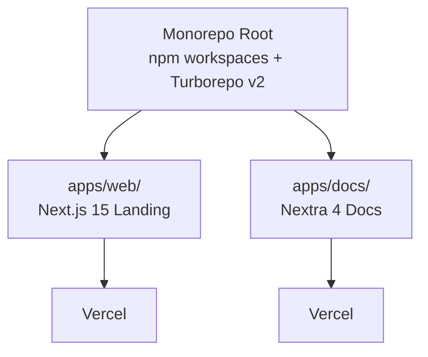

# ctx
Nearby nodes to: /Users/petrsovadina/Desktop/Develope/personal/CzechMed-MCP/voicetree-28-3/frontend-overview.md
```
Frontend Apps Overview
├── Frontend Apps (Web + Docs)
│   ├── Voicetree
│   │   ├── Generate codebase graph (run me)
│   │   ├── Hover over me
│   │   ├── Hello
│   │   ├── Core & Infrastructure
│   │   ├── Czech Healthcare Modules
│   │   ├── Biomedical Domain Modules
│   │   ├── Arcade Deploy Layer
│   │   ├── CLI & Server Modes
│   │   └── Router & Tool Registration
├── apps/web/ — Landing Page Architecture
└── apps/docs/ — Nextra Documentation
```

## Node Contents 
- **Frontend Apps (Web + Docs)** (/Users/petrsovadina/Desktop/Develope/personal/CzechMed-MCP/voicetree-28-3/frontendapps.md)
  # Frontend Apps (Web + Docs)
Next.js 15 landing page (apps/web/) a Nextra 4 dokumentace (apps/docs/) v Turborepo monorepu.
**Root path:** `apps/web/` + `apps/docs/`
**Tech:** Next.js 15, React 19, Nextra 4, Tailwind, Turborepo orchestrace
**Purpose:** Landing page pro CzechMedMCP projekt a interaktivní dokumentace. Deploy na Vercel. Node 20.x (pinováno kvůli @napi-rs/simple-git bug).
[\[welcome_to_voicetree]\]
- **apps/web/ — Landing Page Architecture** (/Users/petrsovadina/Desktop/Develope/personal/CzechMed-MCP/voicetree-28-3/web-landing-page.md)
  # apps/web/ — Landing Page Architecture
Single-page Next.js 15 + React 19 + Tailwind 4 landing page s 13 komponentami. Dark-first theme (next-themes), Geist fonts, custom scroll animations (IntersectionObserver). Statický export.
**Stack:** Next.js 15, React 19, Tailwind CSS 4, next-themes, clsx + tailwind-merge
### Components (13 total)
| Component | Type | Purpose |
|-----------|------|---------|
| `layout.tsx` | Server | Root: metadata, ThemeProvider, Geist fonts |
| `page.tsx` | Server | Composes 10 section components |
| `navbar.tsx` | Client | Fixed nav, mobile hamburger, docs link |
| `hero.tsx` | Server | Gradient hero, floating orbs, terminal block |
  ...11 additional lines
- **apps/docs/ — Nextra Documentation** (/Users/petrsovadina/Desktop/Develope/personal/CzechMed-MCP/voicetree-28-3/nextra-docs.md)
  # apps/docs/ — Nextra Documentation
Nextra 4.6.1 dokumentace s 47 MDX stránkami ve 6 sekcích. České UI (editLink, feedback, toc). Static export, custom navbar s GitHub linkem.
**Stack:** Nextra 4.6.1, nextra-theme-docs 4.6.1, Next.js 15.5.12, React 19.2.4
### Structure (6 sections, ~47 pages)
```
├─ Úvod (full layout, no sidebar)
├─ Začínáme: Instalace, Claude Desktop, API klíče, První dotaz
├─ Nástroje: SUKL, MKN-10, NRPZS, SZV, VZP, Globální, Workflow
├─ Příručka: Workflow, Léky, Diagnostika, Varianty, Studie, FAQ
├─ Architektura: HTTP pipeline, Router, Moduly, cBioPortal, Výjimky
  ...10 additional lines
- **Voicetree** (/Users/petrsovadina/Desktop/Develope/personal/CzechMed-MCP/voicetree-28-3/welcome_to_voicetree.md)
  # Voicetree
## The spatial IDE for multi-agent orchestration
##### Build massive projects out of hundreds of agent sessions whose outputs are all saved, connected together, and turned into a Markdown mindmap. Spatially navigate the graph to hand-hold agents as they recursively fork themselves.
Optimise for seeing only the most relevant information at the necessary level of abstraction.
ready? [\[run_me.md]\]
explore the features [\[hover_over_me.md]\]
- **Generate codebase graph (run me)** (/Users/petrsovadina/Desktop/Develope/personal/CzechMed-MCP/voicetree-28-3/run_me.md)
  # Generate codebase graph (run me)
### Your task is to run the following workflow
1. **Quick scan** — identify the top ~7 major modules using lightweight exploration only (glob directory listings, read a few entry points). Do NOT deep-dive into any module. The goal is just module names, root paths, and a one-line purpose each.
2. **Create a skeleton node** for each module containing only:
    - Module name and root path
    - One-line purpose
    - A distinct color per module (submodules inherit color)
3. **Spawn one voicetree agent per module**. Each agent is responsible for:
    - Deep-exploring its module (read key files, trace flows)
    - Updating its parent node with: concise purpose summary, mermaid diagram for core flow, notable gotchas or tech debt
  ...7 additional lines
- **Hover over me** (/Users/petrsovadina/Desktop/Develope/personal/CzechMed-MCP/voicetree-28-3/hover_over_me.md)
  # Hover over me
Recommended usage for agentic engineering:
1. Brainstorm a large task in the mindmap itself. Get AI to help review and suggest options as needed.
2. Start executing agents on branches of the brainstorm. For larger/harder parts of the project, Tell agents to "decompose plan into a dependency graph of nodes, and then spawn voicetree agents to work through it"
3. Rotate between the idle agents (cmd + [\[ keyboard shortcut), to see if they need help or to be nudged towards true completion.
4. Since the feature will never be pixel perfect on the first iteration, for running next steps, spawn agents directly on handover notes automatically created by the previous sessions.
5. Zoom out to see the big picture of the shape of the work you and your agents did, useful for identifying productivity bottlenecks.
### Voicetree features
Above the node editor, you will see 6 buttons, these are all the actions you can perform on a node. Try adding a child node now.
Markdown support:
  ...46 additional lines
- **Hello** (/Users/petrsovadina/Desktop/Develope/personal/CzechMed-MCP/voicetree-28-3/welcome_to.md)
  # Hello
welcome to [\[welcome_to_voicetree.md]\]
- **Core & Infrastructure** (/Users/petrsovadina/Desktop/Develope/personal/CzechMed-MCP/voicetree-28-3/coreinfrastructure.md)
  # Core & Infrastructure
Základní vrstva: FastMCP singleton, HTTP klient s cache/retry/circuit breaker, konstanty, výjimky, rate limiter, connection pool, utils.
**Root path:** `src/czechmedmcp/` (top-level .py files) + `src/czechmedmcp/utils/`
**Key files:** core.py, constants.py, exceptions.py, http_client.py, auth.py, circuit_breaker.py, connection_pool.py, rate_limiter.py, retry.py, render.py, metrics.py
**Purpose:** Sdílená infrastruktura pro všechny doménové moduly — HTTP pipeline (cache → circuit breaker → retry → parse), FastMCP app singleton, Pydantic helpers, markdown rendering.
[\[welcome_to_voicetree]\]
- **Czech Healthcare Modules** (/Users/petrsovadina/Desktop/Develope/personal/CzechMed-MCP/voicetree-28-3/czechhealthcare.md)
  # Czech Healthcare Modules
23 nástrojů pro české zdravotnictví — SUKL (léky, lékárny), MKN-10 (diagnózy), NRPZS (poskytovatelé), SZV (výkony), VZP (úhrady), diagnosis assist.
**Root path:** `src/czechmedmcp/czech/`
**Submodules:** sukl/ (DrugIndex, DLP API), mkn/ (ICD-10 CZ, synonymy, stats), nrpzs/ (registr poskytovatelů), szv/ (seznam výkonů), vzp/ (úhrady), diagnosis_embed/ (FAISS embeddings), workflows/ (diagnosis_assistant, referral_assist)
**Purpose:** Propojení AI asistentů s českými zdravotnickými registry a databázemi. SUKL DrugIndex = in-memory index 68K léků.
[\[welcome_to_voicetree]\]

<ADDITIONAL_NEARBY_NODES count="4" note="Content omitted — use get_unseen_nodes_nearby or read the file directly">
- Biomedical Domain Modules: /Users/petrsovadina/Desktop/Develope/personal/CzechMed-MCP/voicetree-28-3/biomedicaldomains.md
- Arcade Deploy Layer: /Users/petrsovadina/Desktop/Develope/personal/CzechMed-MCP/voicetree-28-3/arcadedeploy.md
- CLI & Server Modes: /Users/petrsovadina/Desktop/Develope/personal/CzechMed-MCP/voicetree-28-3/climodule.md
- Router & Tool Registration: /Users/petrsovadina/Desktop/Develope/personal/CzechMed-MCP/voicetree-28-3/routertools.md
</ADDITIONAL_NEARBY_NODES>
<TASK> IMPORTANT. YOUR specific task, and the most relevant context is the source note you were spawned from, which is:
        /Users/petrsovadina/Desktop/Develope/personal/CzechMed-MCP/voicetree-28-3/frontend-overview.md: # Frontend Apps Overview

CzechMed-MCP má 2 frontend apps: Next.js 15 landing page (apps/web/) a Nextra 4 dokumentaci (apps/docs/). Obě staticky exportované, deploynuté na Vercel, orchestrované Turborepo v2. Node 20.x pinováno kvůli @napi-rs/simple-git bug.

## Monorepo Orchestration

**Root:** npm workspaces (`apps/*`, `packages/*`) + Turborepo v2, npm 10.9.2

```
turbo.json tasks:
  build → dependsOn: [^build], outputs: [.next/**, out/**]
  dev → cache: false, persistent: true
```

**Vercel deploy:** Each app has own `vercel.json`. Docs uses `cd ../.. && npm install` pattern for monorepo.

### Key URLs
- Docs: `https://czech-med-mcp-docs.vercel.app`
- GitHub: `https://github.com/petrsovadina/CzechMedMCP`

## Diagram



### NOTES

- Node 20.x PINOVÁNO — Node 24 má bug s @napi-rs/simple-git
- apps/docs má vlastní package-lock.json (247KB) — možný dependency drift
- Obě apps jsou čistě statické exporty, žádné API routes

[\[frontendapps]\]
 </TASK>

