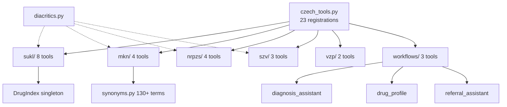

# Czech Healthcare Modules — Architecture Overview

23 MCP nástrojů v 6 submodulech + 3 workflow orchestrátory. Všechny sdílí lazy-init vzor s diskcache a diacritics-insensitive search.

## Architektura (23 nástrojů, `src/czechmedmcp/czech/`)

| Submodul | Nástroje | Datový zdroj | Init vzor |
|----------|----------|--------------|----------|
| **sukl/** | 8 | SUKL DLP API (REST) | Lazy DrugIndex singleton (~46K entries, ~14MB) |
| **mkn/** | 4 | ÚZIS CSV open data | In-memory LRU (~20MB), synonym dict |
| **nrpzs/** | 4 | ÚZIS CSV open data | In-memory list, diskcache raw CSV |
| **szv/** | 3 | MZ ČR Excel (openpyxl) | In-memory list, 1-day cache |
| **vzp/** | 2 | Via SUKL DrugIndex | Sdílí SUKL init |
| **workflows/** | 3 | Orchestrace ostatních | Žádný vlastní state |

### Registrace
Všech 23 v `czech_tools.py` přes `@mcp_app.tool()` s prefixem `czechmed_`. Tenké wrappery delegují na privátní `_function()`. SUKL tools mají `asyncio.wait_for()` timeout.

### Sdílená infrastruktura
- **diacritics.py**: NFD normalization → strip combining marks → lowercase. Použito všude.
- **response.py**: Dual output (`content` Markdown + `structuredContent` dict) dle FR-025.
- Všechny modules: module-level `None` sentinel → lazy async init → diskcache → in-memory.

## Diagram

[[czechhealthcare]]
