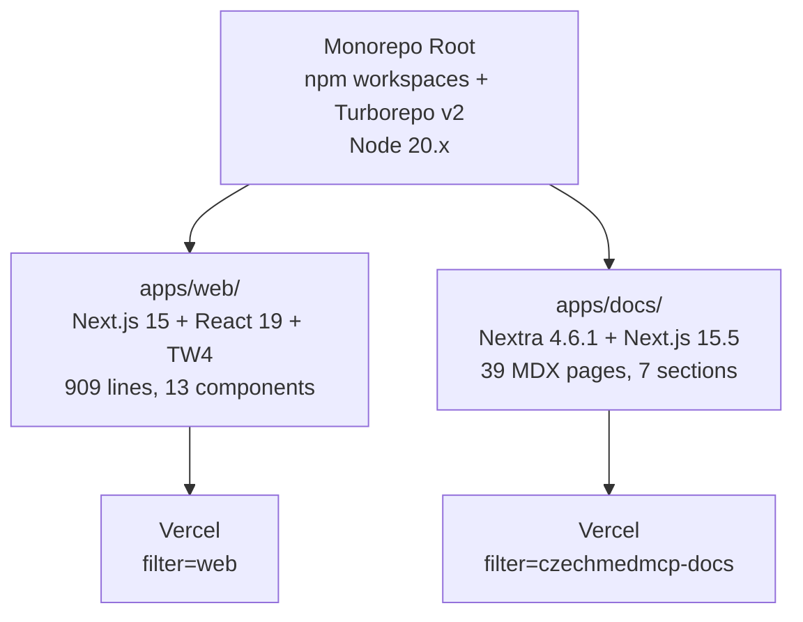

# Frontend Apps Overview

CzechMed-MCP má 2 frontend apps: Next.js 15 landing page (apps/web/) a Nextra 4 dokumentaci (apps/docs/). Obě staticky exportované (`output: 'export'`), deploynuté na Vercel, orchestrované Turborepo v2. Node 20.x pinováno kvůli @napi-rs/simple-git bug.

## Monorepo Orchestration

**Root:** npm workspaces (`apps/*`, `packages/*`) + Turborepo v2, npm 10.9.2

| turbo.json task | dependsOn | outputs | cache |
|-----------------|-----------|---------|-------|
| `build` | `[^build]` | `.next/**, out/**` | yes |
| `dev` | — | — | false, persistent |
| `lint` | `[^build]` | — | yes |

**npm scripts:** `dev:web` (`--filter=web`), `dev:docs` (`--filter=czechmedmcp-docs`), `build:web`, `build:docs`

### Vercel Deploy Strategy
- **Web:** `installCommand: "npm install"`, `buildCommand: "npx turbo build --filter=web"`
- **Docs:** `installCommand: "cd ../.. && npm install"`, `buildCommand: "cd ../.. && npx turbo build --filter=czechmedmcp-docs"` (naviguje do monorepo root)
- Každá app má vlastní `vercel.json`, framework: nextjs

### Key URLs
- Docs: `https://czech-med-mcp-docs.vercel.app`
- GitHub: `https://github.com/petrsovadina/CzechMedMCP`

## Diagram

### NOTES

- Node 20.x PINOVÁNO — Node 24 má bug s @napi-rs/simple-git native bindings
- apps/docs má vlastní package-lock.json (247KB) — možný dependency drift
- Obě apps jsou čistě statické exporty (`output: 'export'`), žádné API routes
- apps/docs explicitně pinuje `@napi-rs/simple-git-linux-x64-gnu: 0.1.19` pro Vercel build
- Web app nemá `next.config` — čistý default Next.js 15, Tailwind 4 via `@tailwindcss/postcss`
- Zero shared packages v `packages/` — obě apps jsou nezávislé

[[frontendapps]]
