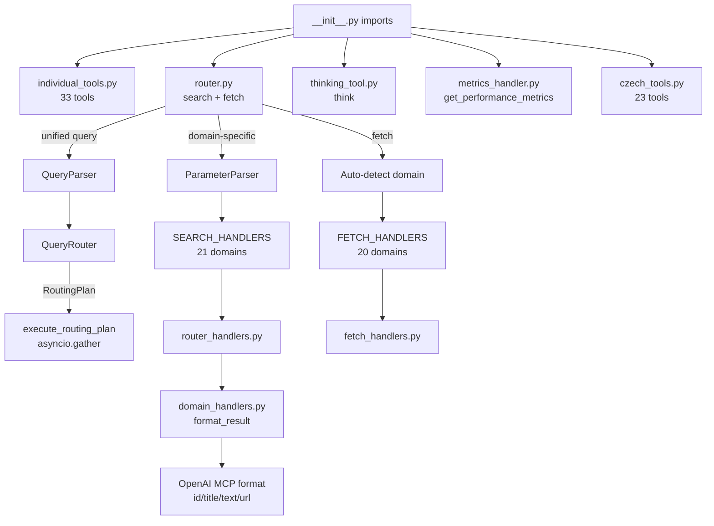

# Router & Tool Registration — Deep Exploration Complete

Deep-explored the Router & Tool Registration module (6,575 lines across 10 files). Mapped the full tool registration pipeline (60 tools from 5 registration points), two search modes (unified query language + domain-specific dispatch), fetch auto-detection, and 21 supported domains. Updated the task node with architecture diagram, file-level breakdown, and identified 5 tech debt items.

## Architecture Overview

The module is the central nervous system of CzechMedMCP — it registers all 60 MCP tools and provides the unified search/fetch dispatcher.

### Tool Registration Pipeline
```
__init__.py imports → @mcp_app.tool() decorator in 5 files
  individual_tools.py  → 33 tools (articles, trials, variants, genes, drugs, diseases, NCI×4, FDA×6, enrichr, cbioportal, oncokb)
  router.py            → 2 tools (search, fetch) — unified dispatcher
  thinking_tool.py     → 1 tool (think) — sequential reasoning
  metrics_handler.py   → 1 tool (get_performance_metrics)
  czech/czech_tools.py → 23 tools (SUKL, MKN, NRPZS, SZV, VZP, diagnosis, referral)
```

### Search Dispatch Architecture
Two modes coexist in `search()`:
1. **Unified**: query with field syntax (`gene:BRAF AND disease:melanoma`) → QueryParser → QueryRouter → parallel asyncio.gather across domains
2. **Domain-specific**: explicit domain + params → ParameterParser → SEARCH_HANDLERS dispatch dict (21 handlers in router_handlers.py)

The mode selection heuristic checks for `:`, `AND`, `OR` markers in the query string. NCI domains force domain-specific mode even with field syntax.

### Fetch Auto-Detection
```python
NCT*       → trial
numeric    → article (PMID)
rs* or :   → variant
DOI format → article
default    → article (⚠️ fails for gene/drug/disease IDs)
```

### Key Design Patterns
- **Dispatch tables**: `SEARCH_HANDLERS` (21 entries) and `FETCH_HANDLERS` (20 entries) — simple dict lookup, O(1)
- **Lazy imports**: All handlers use local imports to avoid circular dependency chains
- **ParameterParser**: Normalizes JSON arrays, CSV strings, and single values into `list[str]`
- **OpenAI MCP format**: All search results → `{results: [{id, title, text, url}]}`, fetch → adds `metadata`
- **Handler return types**: Search handlers return `(items, total)` tuple OR raw dict (FDA/Czech domains)

## File Size Distribution
| File | Lines | % of total |
|------|-------|-----|
| individual_tools.py | 1,951 | 30% |
| router_handlers.py | 996 | 15% |
| fetch_handlers.py | 931 | 14% |
| router.py | 821 | 12% |
| domain_handlers.py | 630 | 10% |
| query_parser.py | 464 | 7% |
| query_router.py | 402 | 6% |
| parameter_parser.py | 192 | 3% |
| thinking_tool.py | 121 | 2% |
| metrics_handler.py | 67 | 1% |

## Files Changed

- /Users/petrsovadina/Desktop/Develope/personal/CzechMed-MCP/voicetree-28-3/routertools.md

## Diagram



### NOTES

- _unified_search() has noqa: C901 — complex orchestration with cBioPortal summary injection mid-results
- search() function has 30+ parameters — the boundary between unified and domain-specific mode is fragile (heuristic check for ':', 'AND', 'OR' in query)
- Fetch auto-detection defaults to 'article' for unrecognized IDs — gene/drug/disease IDs silently misroute
- SEARCH_HANDLERS has 21 entries vs FETCH_HANDLERS 20 — nci_biomarker has search but no fetch handler
- Lazy imports in all handlers prevent circular deps but add ~50ms latency on first call per domain

[[routertools]]
